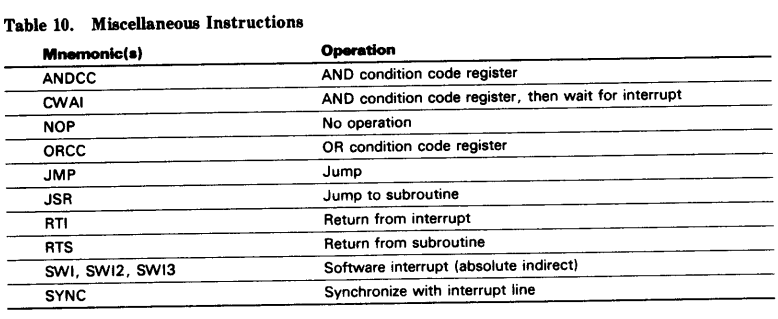
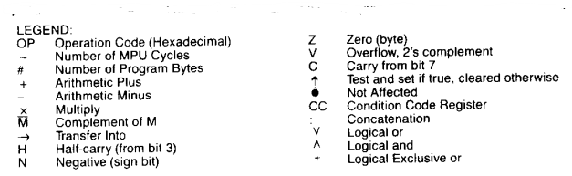

# HD63B09, HD63C09 ... CMOS MPU (Micro Processing Unit) 

## Description 

The HD6309 is the highest 8-bit microprocessor of HMCS6800 family, which is compatible with the conventional HD6809. 

HD6309は、従来のHD6809と互換性のあるHMCS6800ファミリーの最上位8ビット・マイクロプロセッサです。

The HD6309 has hardware and software features which make it an ideal processor for higher level language execution or standard controller applications. 

HD6309は、ハードウェアおよびソフトウェア機能を備えており、より高度な言語実行や標準的なコントローラアプリケーションに最適なプロセッサです。

The HD6309 is complete CMOS device and its power dissipation is extremely low. Moreover, the SYNC and CWAI instruction makes low power application possible. 

HD6309は完全なCMOSデバイスであり、その消費電力は極めて小さい。さらに、SYNC命令とCWAI命令により、低消費電力アプリケーションを可能にします。

<figure style="text-align: center">


</figure>

* Features 
* Hardware - Interfaces with all HMCS6800 peripherals - DMA transfer with no auto-refresh cycle 
* Software: object code compatible with the HD6809 
* Low power consumption mode (Sleep mode) 
  - SYNC state of SYNC Instruction 
  - WAIT state of CWAI Instruction 
* External Clock Inputs - On chip oscillator 
* Wide operation range:  
  f = 0.5 to 3 MHz (Vcc = 5 V±10%) 

* 特徴 
* ハードウェア： すべてのHMCS6800ペリフェラルとのインタフェース - オートリフレッシュサイクルのないDMA転送 
* ソフトウェア：HD6809と互換性のあるオブジェクトコード 
* 低消費電力モード (スリープモード) 
  - SYNC命令のSYNC状態 
  - CWAI命令のWAIT状態 
* 外部クロック入力 - 内蔵発振器 
* 広い動作範囲：  
  広い動作範囲： f = 0.5 to 3 MHz (Vcc = 5 V±10%)

|Type No. |Bus Timing
|--|--|
|HD63B09 |2.0 MHz 
|HD63C09 |3.0 MHz 

<figure style="text-align: center">

<figcaption>図3 ブロック図</figcaption>
</figure>


### Programming Model 

As shown in figure 1, the HD6309 adds three registers to the set available in the HD6800. The added registers are a direct page register, the user stack pointer and a second index register. 

図1に示すように、HD6309はHD6800で使用可能なセットに3つのレジスタを追加しています。追加されたレジスタは、ダイレクト・ページ・レジスタ、ユーザー・スタック・ポインタ、2番目のインデックス・レジスタです。

<figure style="text-align: center">

</figure>

### Accumulators (A, B, D) 

The A and B registers are general purpose accumulators which are used for arithmetic calculations and manipulation of data. 

AおよびBレジスタは汎用アキュムレータで、算術計算やデータ操作に使用されます。

Certain instructions concatenate the A and B registers to form a single 16-bit accumulator. This is referred to as the D register. It is formed with the A register as the most significant byte. 

一部の命令では、A および B レジスタを連結して 1 つの 16 ビット・アキュムレータを構成します。これは D レジスタと呼ばれます。D レジスタは A レジスタを最上位バイトとして形成されます。

### Direct Page Register (DP) 

The direct page register of the HD6309 serves to enhance the direct addressing mode. The contents of this register appears at the higher address outputs (Ag-A15) during direct addressing instruction execution. This allows the direct mode to be used at any place in memory, under program control. To ensure HD6800 compatibility, all bits of this register are cleared during processor reset. 

HD6309のダイレクト・ページ・レジスタはダイレクト・アドレッシング・モードを強化します。ダイレクト・ページ・レジスタ(DP)は、ダイレクト・アドレス指定命令実行時に上位アドレス出力(A8-A15)に表示されます。これにより、ダイレクト・モードはプログラム制御の下で、メモリのどの場所でも使用できるようになります。HD6800との互換性を確保するため、このレジスタの全ビットはプロセッサ・リセット時にクリアされます。

### Index Registers (X, Y) 

The index registers are used in indexed mode addressing. The 16-bit address in this register takes part in the calculation of effective addresses. This address may be used to point to data directly or may be modified by an optional constant or register offset. In some indexed modes, the contents of the index register are incremented or decremented to point to the next item of tabular data. All four pointer registers (X, Y, U, S) may be used as index registers. 

インデックス・レジスタはインデックス・モード・アドレッシングで使用します。このレジスタの16ビット・アドレスは有効アドレスの計算に使用されます。このアドレスは、データを直接指定するために使用することも、オプションの定数またはレジスタ・オフセットによって変更することもできます。いくつかのインデックス・モードでは、インデックス・レジスタの内容は、表データの次の項目を指すためにインクリメントまたはデクリメントされる。4つのポインタ・レジスタ（X、Y、U、S）すべてをインデックス・レジスタとして使用できます。

### Stack Pointer (U, S) 

The hardware stack pointer (S) is used automatically by the processor during subroutine calls and interrupts. The stack pointers of the HD6309 point to the top of the stack, in contrast to the HD6800 stack pointer, which pointed to the next free location on the stack. The user stack pointer (U) is controlled exclusively by the programmer thus allowing arguments to be passed to and from subroutines with ease. Both stack pointers have the same indexed mode addressing capabilities as the X and Y registers. but also support push and pull instructions. This allows the HD6309 to be used efficiently as a stack processor, greatly enhancing its ability to support higher level languages and modular programming. 

ハードウェア・スタック・ポインタ(S)は、サブルーチン呼び出しや割り込みの際にプロセッサが自動的に使用します。HD6309のスタック・ポインタはスタックの先頭を指しますが、HD6800のスタック・ポインタはスタックの次の空き位置を指していました。ユーザー・スタック・ポインター(U)は、プログラマーによって排他的に制御されるため、サブルーチンとの間で引数の受け渡しを簡単に行うことができます。どちらのスタック・ポインタも、XおよびYレジスタと同じインデックス・モード・アドレッシング機能を備えていますが、プッシュおよびプル命令もサポートしています。これにより、HD6309はスタック・プロセッサとして効率的に使用することができ、高級言語やモジュール・プログラミングをサポートする能力が大幅に向上します。

Note: The stack pointers of the HD6309 point to the top of the stack, in contrast to the HD6800 stack pointer, which pointed to the next free location on stack. 

注：HD6309のスタック・ポインタはスタックの先頭を指しますが、HD6800のスタック・ポインタはスタックの次の空き位置を指していました。

> Figure 1. Programming Model of The Microprocessing Unit 

### Program Counter (PC) 

The program counter is used by the processor to point to the address of the next instruction to be executed by the processor. Relative addressing is provided allowing the program counter to be used Condition Code Register Description like an index register in some situations. 

プログラム・カウンタは、プロセッサが次に実行する命令のアドレスを指すために使用します。相対アドレッシングにより、プログラム・カウンタをインデックス・レジスタのように使用できます。

### Condition Code Register (CC) 

The condition code register defines the state of the processor at any given time. See figure 6. 

コンディション・コード・レジスタは、任意の時点でのプロセッサの状態を定義します。図2 を参照してください。

> Figure 2. Condition Code Register Format 

<figure style="text-align: center">

<figcaption>図2. Condition Code レジスタの形式</figcaption>
</figure>


### Condition Code Register Description

### Bit 0 (C) 

Bit 0 is the carry flag. It is usually the carry from the binary ALU. C is also used to represent a 'borrow' from subtract-like instructions (CMP, NEG, SUB, SBC). Then, it is the complement of the carry from the binary ALU. 

ビット 0 はキャリー・フラグです。通常、バイナリ ALU からのキャリーです。Cは、減算命令（CMP、NEG、SUB、SBC）の繰り下がり(borrow)を表すためにも使用されます。このときは、バイナリ ALU からのキャリーの補数です。

### Bit 1 (V) 

Bit 1 is the overflow flag. It is set to a one by an operation which causes a signed two's complement arithmetic overflow. This overflow is detected in an operation in which the carry from the MSB in the ALU does not match the carry from the MSB minus 1. 

ビット1はオーバーフローフラグです。符号付き2の補数算術のオーバーフローを引き起こす演算によって1に設定されます。このオーバーフローは、ALU の MSB からのキャリーが MSB から 1 を引いたキャリーと一致しない演算で検出されます。

### Bit 2 (Z) 

Bit 2 is the zero flag. It is set to one if the result of the previous operation was identically zero. 

ビット2はゼロフラグです。直前の演算結果が同じようにゼロであった場合に 1 に設定されます。

### Bit 3 (N) 

Bit 3 is the negative flag. It contains exactly the value of the MSB of the result of the preceding operation. Thus, a negative two's-complement result will leave N set to one. 

ビット 3 は負フラグです。直前の演算結果の MSB の値がそのまま格納されます。したがって、負の 2 の補数の結果は N を 1 に設定したままにします。

### Bit 4 (I) 

Bit 4 is the IRQ mask bit. The processor will not recognize interrupts from the IRQ line if this bit is set to one. ÑMI, FIRQ, İRQ, RES, and SWI all set I to one; SW12 and SW13 do not affect I. 

ビット4はIRQマスク・ビットです。このビットが 1 に設定されている場合、プロセッサは IRQ ラインからの割り込みを認識しません。ÑMI、FIRQ、İRQ、RES、および SWI はすべて I を 1 に設定しますが、SWI2 および SWI3 は I に影響しません。

### Bit 5 (H) 

Bit 5 is the half-carry bit. It is used to indicate a carry from bit 3 in the ALU as a result of an 8-bit addition only (ADC or ADD). This bit is used by the DAA instruction to perform a BCD decimal add adjust operation. The state of this flag is undefined in all subtract-like instructions. 

ビット5はハーフ・キャリー・ビットです。このビットは、8 ビット加算(ADC または ADD)の結果として、ALU のビット 3 からのキャリーを示すために使用されます。このビットはDAA命令でBCD10進加算調整演算を実行するために使用される。このフラグの状態は、すべての減算類似命令では未定義です。

### Bit 6 (F) 

Bit 6 is the FIRQ mask bit. The processor will not recognize interrupts from the FIRQ line if this bit is a one. NMI, FIRQ, SWI, and RES all set F to one. IRQ, SWI2 and SWI3 do not affect F. 

ビット6はFIRQマスク・ビットです。このビットが1の場合、プロセッサはFIRQラインからの割り込みを認識しません。NMI、FIRQ、SWI、および RES はすべて F を 1 に設定します。IRQ、SWI2、SWI3 は F に影響しません。

### Bit 7 (E) 

Bit 7 is the entire flag. Set to one, it indicates that the complete machine state (all the registers) was stacked, as opposed to the subset state (PC and CC). The E bit of the stacked CC is used on a return from interrupt (RTI) to determine the extent of the unstacking. Therefore, the current E left in the condition code register represents past action. 

ビット 7 は全体のフラグです。1に設定されると、サブセット状態（PCとCCのみ）でななく、完全なマシン状態（すべてのレジスタ）がスタックに保持されたことを示します。スタックに保持されたCCのEビットは、割り込みからの復帰（RTI）で使用され、スタックからの復帰の範囲を決定する。したがって、コンディション・コード・レジスタに残っている現在のEは、過去の動作を表している。

## Signal Description 

### Power (Vss, Vcc) 
Two pins supply power to the part: Vss is ground or 0 volts, while Vcc is +5.0 V ±10%. 

2つのピンが部品に電源を供給する： Vss はグランドまたは 0V、Vcc は +5.0V ±10%。

### Address Bus (A0—A15) 

Sixteen pins output address information from the MPU onto the address bus. When the processor does not require the bus for a data transfer, it will output address FFFF16, R/W=high, and BS=low. This is a "dummy access" or VMA cycle (see figures 25 and 26). All address bus drivers are made high impedance when the bus available output (BA) is high. Each pin will drive one Schottky TTL load or four LS TTL loads, and typically 90 pF. 

MPU からのアドレス情報をアドレス・バスに出力します。プロセッサがデータ転送にバスを必要としない場合、アドレス FFFF、R/W=High、BS=Low を出力する。これは「ダミー・アクセス」または VMA サイクルである（図 25、26 参照）。全てのアドレス・バス・ドライバはバス使用可能出力(BA)がHighの時にハイ・インピーダンスになる。各ピンは1つのショットキーTTL負荷または4つのLS TTL負荷を駆動し、通常90pFを駆動する。

### Data Bus (D0−D7) 

These eight pins provide communication with the system bi-directional data bus. Each pin will drive one Schottky TTL load or four LS TTL loads, and typically 130 pF. 

これらの8つのピンは、システムの双方向データ・バスとの通信を提供します。各ピンは1つのショットキーTTL負荷または4つのLS TTL負荷を駆動し、通常は130pFです。

### Read/Write (R/W) 

This signal indicates the direction of data transfer on the data bus. A low indicates that the MPU is writing data onto the data bus. R/W is made high impedance when BA is high. Refer to figures 25 and 26. 

この信号は、データバス上のデータ転送方向を示します。LowはMPUがデータバスにデータを書き込んでいることを示す。BAがHの時、R/Wはハイ・インピーダンスになります。図 25、図 26 を参照してください。

### Reset (RES) 

A low level on this Schmitt-trigger input for greater than one bus cycle will reset the MPU, as shown in figure 3. The reset vectors are fetched from locations FFFE16 and FFFF16 (table 2) when interrupt acknowledge is true, ( BA · BS=1). During initial power-on, the reset line should be held low until the clock oscillator is fully operational. See figure 4. 

図 3 に示すように、このシュミット・トリガ入力が 1 バスサイクル以上 Low レベルで MPU はリセットされる。リセットベクタは、割り込みアクノリッジが真（BA・BS=1）の時、FFFE と FFFF の位置（表 2）から取り出されます。初期電源投入時には、クロック発振器が完全に動作するまでリセット・ラインをLowに保つ必要がある。図4を参照してください。

HD6309のリセット・ピンは、標準的な周辺回路よりも高いしきい値電圧を持つシュミット・トリガー入力を備えているため、単純なR/Cネットワークを使用してシステム全体をリセットすることができます。この高いしきい値電圧により、すべての周辺回路がプロセッサより先にリセット状態から抜け出すことが保証されます。

#### Table 1. Pin Description (6809 nonE version)

Symbol| Pin No. |I/O |Function 
|--|--|--|--|
Vss|1 ||Ground 
NMI |2 |I|Non maskable interrupt 
IRO |3 |I|Interrupt request 
FIRQ |4|I|Fast interrupt request 
BS, BA|5,6| O|Bus status, Bus available 
Vcc |7|| +5V power supply 
A0-A15|8-23|O |Address bus, bits 0-15 
D7-D0|24-31|I/O|Data bus, bits 0-7 
R/W |32| O|Read/Write output 
DMA/BREQ|33| I|DMA Bus request 
E, Q |34, 35| O| Clock signal 
MRDY |36 |I|Memory ready 
/RES |37| I|Reset input 
EXTAL|38|I|Oscillator connection 
XTAL|39|I|Oscillator connection 
HALT |40|I|Halt input

> Table 1. Pin Description 

#### Table 1. Pin Description (6809E version)

Symbol| Pin No. |I/O |Function 
|--|--|--|--|
Vss|1 ||Ground 
NMI |2 |I|Non maskable interrupt 
IRO |3 |I|Interrupt request 
FIRQ |4|I|Fast interrupt request 
BS, BA|5,6| O|Bus status, Bus available 
Vcc |7|| +5V power supply 
A0-A15|8-23|O |Address bus, bits 0-15 
D7-D0|24-31|I/O|Data bus, bits 0-7 
R/W |32| O|Read/Write output 
BUSY|33| O|DMA Bus request 
E, Q |34, 35|I| Clock Inputs 
AVME |36 |O|Advanced VME
/RES |37| I|Reset input 
LIC|38|O|Last Instruction Cycle
TSC|39|I|Three-State control input
HALT |40|I|Halt input

> Table 1. Pin Description 

#### Table 1b. Pin Description (6809/6809E comparison)

|Pin#|6809|I/O |Function| 6809E |I/O |Function 
|--|--|--|--|--|--|--|
1|Vss||Ground |||
2|NMI |I|Non maskable interrupt||| 
3|IRO |I|Interrupt request |||
4|FIRQ|I|Fast interrupt request||| 
5,6|BS,BA|O|Bus status, Bus available||| 
7|Vcc || +5V power supply |||
8-23|A0-A15|O |Address bus, bits 0-15||| 
24-31|D7-D0|I/O|Data bus, bits 0-7 |||
32|R/W |O|Read/Write output |||
33|DMA/BREQ|I|DMA Bus request |BUSY|O|不可分アクセスを示す
34, 35|E, Q |O| Clock signal output|E, Q|I|input|
36|MRDY |I|Memory ready |AVMA|O|次のバスサイクルでバスを使うことを示す。
37|/RES |I|Reset input |||
38|EXTAL|I|Oscillator connection |LIC|O|
39|XTAL |I|Oscillator connection |TSC|I|
40|HALT |I|Halt input|||

> Table 1. Pin Description 


### Halt (HALT) 
A low level on this input pin will cause the MPU to stop running at the end of the present instruction and remain halted indefinitely without loss of data. When halted, the BA output is driven high indicating the buses are high impedance. BS is also high which indicates the processor is in the halt or bus grant state. While halted, the MPU will not respond to external realtime requests (FIRQ, IRQ) although DMA/BREQ will always be accepted, and NMI or RES will be latched for later response. During the halt state, Q and E continue to run normally. If the MPU is not running (RES), a halted state (BA · BS = 1) can be achieved by pulling HALT low while RES is still low. See figure 5. 

この入力端子が Low レベルになると、MPU は現在の命令の終了時に動作を停止し、データを失うことなく 無限に停止し続けます。停止中は BA 出力がハイレベルになり、バスがハイ・インピーダンスであることを示します。BS出力もHighとなり、プロセッサが停止状態またはバスグラント状態にあることを示す。停止中、MPUは外部からのリアルタイム要求(FIRQ, IRQ)に応答しませんが、DMA/BREQは常に受け付けられ、NMIまたはRESはラッチされます。停止中もQ,Eは正常に動作します。MPUが動作していない(RES)場合、RESがLowのままHALTをLowにすることで停止状態(BA ・ BS = 1)にすることができます。図 5 を参照してください。

### Bus Available, Bus Status (BA, BS) 
The BA output is an indication of an internal control signal which makes the MOS buses of the MPU high impedance. This signal does not imply that the bus will be available for more than one cycle. When BA goes low, an additional dead cycle will elapse before the MPU acquires the bus. 

BA 出力は MPU の MOS バスをハイ・インピーダンスにする内部制御信号である。この信号は、バスが 1 サイクル以上使用可能であることを意味するものではない。BA が Low になると MPU がバスを取得するまでにさらにデッドサイクルが経過する。

The BS output signal, when decoded with BA, represents the MPU state. 

BAとデコードされたBS出力信号はMPUの状態を表す。

> 6309E: valid with leading edge of Qが追記されている。

Interrupt Acknowledge is indicated during both cycles of a hardware vector fetch (RES, NMI, FIRQ, IRQ, SWI, SWI2, SWI3). This signal, plus decoding of the lower four address lines, can provide the user with an indication of which interrupt level is being serviced and allow vectoring by device. See Table 2. 

割り込み許可は、ハードウェアベクタフェッチ(RES, NMI, FIRQ, IRQ, SWI, SWI2, SWI3)の両サイクルで示される。この信号と下位4つのアドレス・ラインのデコードにより、ユーザはどの割り込みレベルが処理されているかを知ることができ、デバイスによるベクタリングが可能になります。表 2 を参照してください。

Sync Acknowledge is indicated while the MPU is waiting for external synchronization on an interrupt line. 

シンク・アクノレッジは、MPUが外部同期を待っている間に表示されます。

Halt/Bus Grant is true when the HD6309 is in a halt or bus grant condition. 

HD6309が停止状態またはバス・グラント状態の時、Halt/Bus Grantが真になります。

> 6309E: ここにInterrupt Acknowledge, Sync Acknowledge, Halt Acknowledgeの項が追記されている。
> 
> Interrupt Acknowldege is indicated during both cycles of a hardware-vector-fetch (RES, NMI, FIRQ, IRQ, SWI, SWI2, SWI3).  This signal, plus decoding of the lower four address lines, can probide the user with an indication of which interrupt level is being serviced and allow vectoring by device.  See Table 1.
> 
> Sync Acknowledge is indicated while the MPU is waiting for external synchronization on an itenrrupt line.
> 
> Halt Acknowledge is indicated when the HD6309E is in a Halt condition.
> 
> 割り込みアクノレッジは、ハードウェア・ベクタ-fetch (RES、NMI、FIRQ、IRQ、SWI、SWI2、SWI3) の両サイクル中に表示されます。 この信号と下位4つのアドレス・ラインのデコードにより、どの割り込みレベルがサービスされているかが分かり、デバイスによるベクタリングが可能になります。 表 1 を参照。
> 
> MPU が外部同期を待っている間、割り込み信号が出力されます。
> 
> HD6309E が停止状態にあるとき、Halt Acknowledge を表示します。

### Non Maskable Interrupt (NMI) 
A negative edge on NMI requests that a non-maskable interrupt sequence be generated. A non-maskable interrupt cannot be inhibited by the program, and also has a higher priority than FIRQ, IRQ or software interrupts. During recognition of an NMI, the entire machine state is saved on the hardware stack. After reset, an NMI will not be recognized until the first program load of the hardware stack pointer (S). The pulse width of NMI low must be at least one E cycle. If the NMI input does not meet the minimum set up with respect to Q, the interrupt will not be recognized until the next cycle See figure 6. 

NMIの負エッジはノンマスカブル割り込みの発生を要求します。ノンマスカブル割り込みは、プログラマが割り込みを禁止することができず、FIRQ、IRQ、ソフトウェア割り込みよりも優先度が高くなります。NMI を認識している間、マシン状態全体がハードウェア・スタックに保存されます。リセット後、NMI は、ハードウェア・スタック・ポインタ（S）の最初のプログラム・ロードまで認識されません。NMIローのパルス幅は、少なくとも1Eサイクルでなければならない。NMI 入力が Q に対して設定された最小値を満たさない場合、割り込みは次のサイクルまで認識されません 図 6 を参照してください。

> Table 2. Memory Map for Interrupt Vectors 

<figure style="text-align: center">
<div>

<figcaption>Memory Map and Interrupt Vector</figcaption>
</div>
<div>

<figcaption>MPU State Definition</figcaption>
</div>
</figure>

Table 3. MPU State Definition 

|BA|BS|MPU State
|--|--|--| 
0|0|Normal (Running) 
0 |1|Interrupt or RESET Acknowledge 
1|0|SYNC Acknowledge 
1|1|HALT or Bus Grant 

<figure style="text-align: center">

<figcaption>図3. RES Timing</figcaption>
</figure>

> Figure 3. RES Timing 

<figure style="text-align: center">

<figcaption>図4. Crystal Connections and Oscillator Start Up </figcaption>
</figure>

> Figure 4. Crystal Connections and Oscillator Start Up 

<figure style="text-align: center">

<figcaption>図5. HALT and Single Instruction Execution for System Debug  </figcaption>
</figure>

> Figure 5. HALT and Single Instruction Execution for System Debug 

<figure style="text-align: center">

<figcaption>図6. IRQ and NMI Interrupt Timing</figcaption>
</figure>

> Figure 6. IRQ and NMI Interrupt Timing 

<figure style="text-align: center">

<figcaption>図7. FIRQ Interrupt Timing</figcaption>
</figure>

> Figure 7. FIRQ Interrupt Timing 

### Fast Interrupt Request (FIRQ) 
A low level on FIRQ input will initiate a fast interrupt sequence provided its mask bit (F) in the CC is clear. This sequence has priority over the standard interrupt request (IRQ). It is fast in the sense that it stacks only the contents of the condition code register and the program counter. The interrupt service routine should clear the source of the interrupt before doing an RTI. See figure 7. 

FIRQ入力がロー・レベルになると、CCのマスク・ビット(F)がクリアされている限り、高速割り込み シーケンスが開始されます。このシーケンスは標準割り込み要求（IRQ）よりも優先されます。これは、コンディショニング・コード・レジスタとプログラム・カウンタの内容のみをスタックするという意味で高速です。割り込みサービス・ルーチンは RTI を実行する前に割り込み元をクリアする必要があります。図 7 を参照してください。

### Interrupt Request (IRQ) 
A low level input on IRQ will initiate an interrupt request sequence provided the mask bit (I) in the CC is clear. Since IRQ stacks the entire machine state it provides a slower response to interrupts than FIRQ. IRQ also has a lower priority than FIRQ. Again, the interrupt service routine should clear the source of the interrupt before doing an RTI. See figure 6. 

IRQにロー・レベルの入力があると、CCのマスク・ビット(I)がクリアされている限り、割り込み要求シーケンスが開始します。IRQ はマシン状態全体をスタックに退避するので、FIRQ よりも割り込みに対する応答が遅くなります。IRQ は FIRQ よりも優先度が低い。この場合も、割り込みサービス・ルーチンは RTI を実行する前に割り込み元をクリアする必要があります。図 6 を参照。

Note: NMI, FIRQ, and IRQ requests are sampled on the falling edge of Q. One cycle is required for synchronization before these interrupts are recognized. The pending interrupt(s) will not be serviced until completion of the current instruction unless a SYNC or CWAI condition is present. IfÏRQ and FIRQ do not remain low until completion of the current instruction they may not be recognized. However, NMI is latched and need only remain low for one cycle. 

注: NMI、FIRQ、IRQ のリクエストは Q の立ち下がりエッジでサンプリングされます。保留中の割り込みは、SYNC または CWAI 条件が存在しない限り、現在の命令が完了するまで処理されません。もしÏRQとFIRQが現在の命令の完了までローのままでなければ、それらは認識されないかもしれない。しかし、NMIはラッチされるので、1サイクルだけローを維持すればよい。

> 6309E: 独自端子の項目。
> 
> ### Clock Inputs E, Q
> E and Q are the clock signals required by the HD6309E.  Q must lead E; that is, a transition on Q must be followed by a similar transition on E after minimum delay.  Addresses will be vaild from the MPU, tAD after the falling edge of E, and data will be latched from the bus by the falling edge of E.  While the Q input is fully TTL compatible, the E input directly drives internal MOS circuitry and, thus, requires levels above normal TTL levels.  This approach minimizes clock skew inherent with an internal buffer.  Timing and waveforms for E and Q are shown in Figure 1 and 2 while Figure 11 shows a simple clock generator for the HD6309E.
> 
> EとQはHD6309Eが必要とするクロック信号です。 QはEをリードしていなければなりません。つまり、Qの遷移の後、最小の遅延でEが同様の遷移をする必要があります。 アドレスはEの立ち下がりエッジの後tADでMPUからベールドされ、データはEの立ち下がりエッジでバスからラッチされます。Q入力は完全にTTL互換ですが、E入力は内部MOS回路を直接駆動するため、通常のTTLレベル以上のレベルが必要です。 このアプローチにより、内部バッファ特有のクロックスキューを最小限に抑えることができる。 EとQのタイミングと波形を図1と2に、HD6309Eのシンプルなクロック・ジェネレーターを図11に示します。
> 
> ### BUSY
> 
> BUSY will be "High" for the read and modify cycles of a read-modify-write instruction and during the access of the first byte of a double-byte operation (e.g., LDX, STD, ADDD).  Busy is also "High" during the first byte of any indirect or other vector fetch (e.g., jump extended, SWI indirect etc.).
> 
> BUSY は、リード-モディファイ-ライト命令のリードおよびモディファイサイクル、およびダブルバイト演算（LDX、STD、ADDDなど）の最初のバイトのアクセス中に "High"になります。 ビジーは、間接命令やその他のベクタ・フェッチ（ジャンプ拡張命令、SWI間接命令など）の最初のバイトの間にも "High"になります。
> 
> In a multi-processor system, busy indicates the need to defer the rearbitration of the next bus cycle to insure the integrity of the above operations.  This difference provides the indivisible memory access required for a "test-and-set" primitive, using any one of several read-modify-write instructions.
> 
> マルチプロセッサ・システムでは、BUSYは、上記の操作の完全性を保証するために、次のバス・サイクルの再アービトレーションを延期する必要性を示す。 この違いは、いくつかのリード・モディファイ・ライト命令のいずれかを使用して、「テスト・アンド・セット」プリミティブに必要な分割不可能なメモリ・アクセスを提供する。
>
> Busy does not become active during PSH or PUL operations.  A typical read-modify-write instruction (ASL) is shown in Figure 12.  Timing information is given in Figure 13.  Busy is valid tCD after the rising edge of Q.
> 
> PSH または PUL 動作中、ビジーはアクティブにならない。 非定型リード・モディファイ・ライト命令（ASL）を図 12 に示す。 タイミング情報を図 13 に示す。 ビジーはQの立ち上がりエッジからtCD後に有効になる。
>
> ### AVMA
> AVMA is the Advanced VMA signal and indicates that the MPU will use the bus in the following bus cycle.  The predictive nature of the AVMA signal allow s efficient shared-bus multiprocessor system.  AVMA is "Low" when the MPU is in either a HALT or SYNC state.  AVBMA is valid tCD after the rising edge of Q.
> 
> AVMAはAdvanced VMA信号で、MPUが次のバス・サイクルでバスを使用することを示す。 AVMA信号の予測性により、効率的な共有バス・マルチプロセッサ・システムを実現します。 AVMAはMPUがHALTまたはSYNC状態の時に "Low"となる。 AVBMAはQの立ち上がりからtCD後に有効となる。
> 
> ### LIC
> LIC (Last Instruction Cycle) is "High" during the last cycle of every instruction, and its transition from "High" to "Low" will indicate that the first byte of an opcode will be latched at the end of the present bus cycle.  LIC will be "High" when the MPU is Halted at the end of an instruction, (i.e., not in CWAI or RESET) in SYNC state or while stacking during interrupts.  LIC is vaild tCD after the rising edge of Q.
> 
> LIC(Last Instruction Cycle)は各命令の最終サイクルで "High"となり、"High"から "Low "への遷移は現在のバス・サイクル終了時にオペコードの1バイト目がラッチされることを示す。 LICは命令終了時にMPUが停止している時（CWAIやRESET中でない時）、SYNC状態の時、または割り込み中のスタック中に "High"となる。 LICはQの立ち上がりからtCD後に "V"となる。
>
> ### TSC
> TSC (Three-State Control) will cause MOS address, data, and R/W buffers to assume a high-impedance state.  The control signals (BA, BS, BUSY, AVMA and LIC) will not go to the high-impedance state.  TSC is intended to allow a single bus to be shared with other bus masters (processors or DMA controllers).
> 
> TSC(Three-State Control)はMOSアドレス、データ、R/Wバッファをハイインピーダンス状態にする。 制御信号（BA、BS、BUSY、AVMA、LIC）はハイインピーダンス状態にならない。 TSCは、1つのバスを他のバス・マスタ（プロセッサやDMAコントローラ）と共有できるようにするためのものである。
> 
> While E is "Low", TSC controls the address buffer and R/W directly.  The data bus buffers during a write operation are in a hifh-impedance state until Q rises at which time, if TSC is true, they will remain in a high-impedance state.   If TSC is held beyond the rising edge of E, then it will be internally latched, keeping the bus drivers in a high-impedance state for the remainder of the bus cycle.  See Figure 14.
> 
> Eが "Low"の間、TSCはアドレス・バッファとR/Wを直接制御する。 書き込み動作中のデータ・バス・バッファは、Qが立ち上がるまでハイフインピーダンス状態にあり、その時TSCが真であれば、ハイインピーダンス状態を維持する。  TSCがEの立ち上がりエッジを超えて保持された場合、TSCは内部でラッチされ、バス・ドライバはバス・サイクルの残りの期間、ハイ・インピーダンス状態を維持する。 図14を参照。
> 
> <figure style+"text-align: center">
> 
> </figure>
>
> Figure11 HD6309E CLock Generator
> 
> <figure style+"text-align: center">
> 
> </figure>
>
> Figure12 Read Modify Write Instruction Example (ASL Extended Indirect)
>
> <figure style+"text-align: center">
> 
> </figure>
>
> Figure13 BUSY Timing
>
> <figure style+"text-align: center">
> 
> </figure>
>
> Figure14 TSC Timing
>
> <figure style+"text-align: center">
> 
> </figure>
>
> Figure15 Flowchart for HD6303E Instruction

### XTAL, EXTAL (6809のみ)
These two pins are connected with parallel reso-nant fundamental crystal, AT cut. Alternately, the pin EXTAL may be used as a TTL level input for external timing with XTAL floating. The crystal or external frequency is four times the bus frequency. See figure 4. Proper RF layout techniques should be observed in the layout of printed circuit boards. 

これらの2つのピンは、並列抵抗基本水晶振動子、ATカットで接続されます。また、EXTALピンは、XTALをフローティングにして外部タイミング用のTTLレベル入力として使用することもできます。水晶振動子または外部周波数はバス周波数の4倍です。図 4 を参照。プリント回路基板のレイアウトには、適切なRFレイアウト技術を遵守する必要があります。

Note for Board Design of the Oscillation Circuit: In designing the board, the following notes should be taken when the crystal oscillator is used. See figure 8. 

発振回路の基板設計上の注意： 基板設計において、水晶発振器を使用する場合は以下の注意が必要である。図8参照。

1. Crystal oscillator and load capacity Cin, Cout must be placed near the LSI as much as possible. (Normal oscillation may be disturbed when external noise is induced to pin 38 and 39.) 
2. Pin 38 and 39 signal line should be wired apart from other signal line as much as possible. Don't wire them in parallel with other lines. (Normal oscillation may be disturbed when E or Q signal feeds back to pin 38 and 39.) 

1. 水晶発振器と負荷容量Cin,CoutはできるだけLSIの近くに配置すること。(38,39ピンに外来ノイズが誘導されると正常な発振が妨げられることがあります。) 
2. 38,39 ピンの信号線は他の信号線とできるだけ離して配線して下さい。他のラインと並列に配線しないで下さい。(38,39ピンにE,Q信号がフィードバックされると正常な発振が妨げられることがあります。) 

<figure style="text-align: center">

<figcaption>図8. Board Design of the Oscillation Circuit</figcaption>
</figure>

> Figure 8. Board Design of the Oscillation Circuit 

Designs to be Avoided: A signal line or a power source line must not cross or go near the oscillation circuit line as shown in figure 9 to prevent induction from these lines. The resistance between XTAL, EXTAL and other pins should be over 10 ΜΩ. 

避けるべき設計: 発振回路ラインからの誘導を防ぐため、図9のように信号ラインや電源ラインが発振回路ラインと交差したり、近づいたりしないようにして下さい。XTAL,EXTAL端子間の抵抗は10ΜΩ以上とする。

### E, Q (6809のみ)
E is similar to the HD6800 bus timing signal 2: Q is a quadrature clock signal which leads E. Q has no parallel on the HD6800. Data is latched on the falling edge of E. Timing for E and Q is shown in figure 10. 

EはHD6800のバス・タイミング信号2と同様で、QはEをリードする直交クロック信号です。EとQのタイミングを図10に示します。

### Memory Ready (MRDY)  (6809のみ)
This input control signal allows stretching of E and Q to extend data-access time. E and Q operate normally while MRDY is high. When MRDY is low, E and Q may be stretched in integral multiples of half (1/2) bus cycles, thus allowing interface to slow memories, as shown in figure 11. The maximum stretch is 5 microseconds. 

この入力制御信号により、EとQを伸ばしてデータ・アクセス時間を延長することができます。MRDY が H の間、E と Q は正常に動作します。MRDY がローの時、E と Q はハーフ（1/2）バス・サイクルの整数倍で伸張することができ、図 11 に示すように低速メモリへのインターフェイスが可能になります。最大ストレッチは5マイクロ秒である。

During nonvalid memory access (VMA cycles) MRDY has no effect on stretching E and Q: this inhibits slowing the processor during "don't care" bus accesses.  MRDY may also be used to stretch clocks (for slow memory) when bus control has been transferred to an external device (through the use of HALT and DMA/BREQ). 

非有効メモリ・アクセス（VMAサイクル）の間、MRDYはEとQの伸張に影響しない。これは、「don't care」バス・アクセスの間にプロセッサを遅くすることを抑制する。 MRDYは、バス制御が（HALTやDMA/BREQを使用して）外部デバイスに転送された場合に、（低速メモリ用に）クロックをストレッチするために使用することもできる。

MRDY also stretches E and Q during dead cycles. 

MRDY はまた、デッドサイクル中に E と Q をストレッチします。

### DMA Bus Request (DMA/BREQ)  (6809のみ)
The DMA/BREQ input provides a method of suspending execution and acquiring the MPU bus for another use, as shown in figure 12. Typical uses include DMA and dynamic memory refresh. 

DMA/BREQ 入力は、図 12 に示すように、実行を一時停止し、MPU バスを別の用途のために使用するた めのものである。代表的な用途は、DMA やダイナミック・メモリ・リフレッシュである。

Transition of DMA/BREQ should occur during Q. A low level on this pin will stop instruction execution at the end of the current cycle. The MPU will acknowledge DMA/BREQ by setting BA and BS to high level. The HD6309 does not perform the auto-refresh executed in the HD6809. See figure 13. 

DMA/BREQの遷移はQ中に発生する。このピンがLレベルになると現在のサイクルの最後で命令実行を停止する。MPUはBAとBSをハイレベルにすることによりDMA/BREQを認識します。HD6809で実行されたオートリフレッシュはHD6309では実行されません。図13を参照してください。

Typically, the DMA controller will request to use the bus by asserting DMA/BREQ pin low on the leading edge of E. When the MPU replies by setting BA and BS to one, that cycle will be a dead cycle used to transfer bus mastership to the DMA controller. 

通常、DMA コントローラは E の立ち上がりエッジで DMA/BREQ 端子をロー・アサートしてバス の使用を要求し、MPU が BA、BS を 1 にして応答すると、そのサイクルは DMA コントローラにバスのマスタリ ングを移すためのデッド・サイクルとなる。

<figure style="text-align: center">

<figcaption>図9. Example of Normal Oscillation may be Disturbed</figcaption>
</figure>

> Figure 9. Example of Normal Oscillation may be Disturbed  (6809のみ)

False memory accesses may be prevented during dead cycles by developing a system DMÄVMA signal which is low in any cycle when BA has changed. 

BAが変化したサイクルでLowになるシステムDMÄVMA信号を開発することで、デッドサイクル中の偽メモリアクセスを防ぐことができる。

When BA goes low (a result of DMA/BREQ = high), another dead cycle will elapse before the MPU accesses memory, to allow transfer of bus mastership without contention. 

BAがLowになる(DMA/BREQがHighになる)と、MPUがメモリにアクセスする前に別のデッド・サイクルが経過し、競合なしにバスのマスタシップを転送できるようになる。

The DMA/BREQ input should be tied high during reset state. 

DMA/BREQ入力はリセット状態の間Highに接続する。

<figure style="text-align: center">

<figcaption>図10. E/Q Relationship</figcaption>
</figure>

> Figure 10. E/Q Relationship (6809のみ) 

<figure style="text-align: center">

<figcaption>図11. MRDY Clock Stretching </figcaption>
</figure>

> Figure 11. MRDY Clock Stretching  (6809のみ)

## MPU Operation 
During normal operation, the MPU fetches an instruction from memory and then executes the requested function. This sequence begins at RES and is repeated indefinitely unless altered by a special instruction or hardware occurrence. Software instructions that alter normal MPU operation are: SWI, SWI2, SW13, CWAI, RTI and SYNC. An interrupt, HALT or DMA/BREQ can also alter the normal execution of instructions. Figure 14 illus trates the flow chart for the HD6309. 

通常動作時、MPUはメモリから命令をフェッチし、要求された機能を実行します。このシーケンスは RES から始まり、特別な命令やハードウェアの発生により変更されない限り、 無限に繰り返されます。MPUの通常動作を変更するソフトウェア命令は以下の通りです： SWI、SWI2、SW13、CWAI、RTI、SYNC。また、割り込み、HALT、DMA/BREQ によっても通常の命令の実行が変更されることがあります。図 14 に HD6309 のフローチャートを示します。

<figure style="text-align: center">

<figcaption>図11. MRDY Clock Stretching </figcaption>
</figure>

> Figure 12. Typical DMA Timing 

<figure style="text-align: center">

<figcaption>図11. MRDY Clock Stretching </figcaption>
</figure>

> Figure 13. DMA Timing 


<figure style="text-align: center">

<figcaption>図11. MRDY Clock Stretching </figcaption>
</figure>

> Figure 14. Flowchart for HD6309 Instruction 

## Addressing Modes 
The basic instructions of any computer are greatly enhanced by the presence of powerful addressing modes. The HD6309 has the most complete set of addressing modes available on any microcomputer today. For example, the HD6309 has 59 basic instructions, however, it recognizes 1464 dif ferent variations of instructions and addressing modes. The addressing modes support modern programming techniques. The following addressing modes are available on the HD6309: 

あらゆるコンピュータの基本的な命令は、強力なアドレッシング・モードの存在によって大幅に強化されます。HD6309のアドレッシング・モードは、現在のマイクロ・コンピュータの中で最も充実しています。例えば、HD6309は59の基本命令を持っていますが、1464種類の命令とアドレッシング・モードを認識します。アドレッシング・モードは最新のプログラミング技術をサポートします。HD6309では以下のアドレッシング・モードが使用できます： 

* Implied (includes accumulator) Immediate 
* Extended 
* Extended indirect 
* Direct 
* Register 
* Indexed 
  - Zero-offset 
  - Constant offset 
  - Accumulator offset 
  - Auto increment/decrement 
* Indexed indirect 
* Relative 
* Program counter relative 

* インプライド（アキュムレータを含む） イミディエイト 
* 拡張 
* 拡張間接 
* ダイレクト 
* レジスタ 
* インデックス付き 
  - ゼロオフセット 
  - 定数オフセット 
  - アキュムレータオフセット 
  - 自動インクリメント/デクリメント 
* インデックス付き間接 
* 相対 
* プログラム・カウンタ相対

### Implied (Includes Accumulator) 
In this addressing mode, the opcode of the instruction contains all the address information necessary. Examples of implied addressing are: ABX, DAA, SWI, ASRA, and CLRB. 

このアドレッシング・モードでは、命令のオペコードに必要なアドレス情報がすべて含まれます。インプライド・アドレッシングの例を以下に示します： ABX、DAA、SWI、ASRA、CLRB。


### Immediate Addressing 
In immediate addressing, the effective address of the data is the location immediately following the opcode (i.e., the data to be used in the instruction immediately follows the opcode of the instruction). The HD6309 uses both 8-and 16-bit immediate values depending on the size of the argument specified by the opcode. Examples of instructions with immediate addressing are: 

イミディエイト・アドレッシングでは、データの実効アドレスはオペコードの直後の位置となります（つまり、命令で使用されるデータは命令のオペコードの直後となります）。HD6309では、オペコードで指定される引数のサイズに応じて、8ビットと16ビットの両方の即値が使用されます。即値指定命令の例を以下に示します： 

```
LDA #$20 
LDX #$F000 
LDY #CAT 
```
Note: # signifies immediate addressing, $ signifies hexadecimal value. 

注: # は即時アドレス指定、$ は 16 進値を表す。

### Extended Addressing 
In extended addressing, the contents of the two bytes immediately following the opcode fully specify the 16-bit effective address used by the instruction. Note that the address generated by an extended instruction defines an absolute address and is not position independent. Examples of extended addressing include: 

拡張アドレス指定では、オペコードの直後の 2 バイトの内容が、その命令で使用される 16 ビットの有効アドレスを完全に指定します。拡張命令で生成されるアドレスは絶対アドレスを定義し、位置には依存しないことに 注意してください。拡張アドレス指定には次のような例がある：

```
LDA CAT 
STX LDD 
MOUSE $2000 
```

### Extended Indirect 
As a special case of indexed addressing (discussed below), one level of indirection may be added to extended addressing. In extended indirect, the two bytes following the postbyte of an indexed instruction contain the address of the data. 

インデックス付きアドレッシング（後述）の特殊なケースとして、拡張アドレッシングに 1 つのレベルの間接を追加することができます。拡張間接では、インデックス付き命令のポストバイトに続く2バイトがデータのアドレスを含む。

```
LDA [CAT] 
LDX [$FFFE] 
STU [DOG] 
```

### Direct Addressing 
Direct addressing is similar to extended addressing except that only one byte of address follows the opcode. This byte specifies the lower 8 bits of the address to be used. The upper 8 bits of the address are supplied by the direct page register. Since only one byte of address is required in direct addressing, this mode requires less memory and executes faster than extended addressing. Of course, only 256 locations (one page) can be accessed without redefining the contents of the DP register. Since the DP register is set to $00 on reset, direct addressing on the HD6309 is compatible with direct addressing on the HD6800. Indirection is not allowed in direct addressing. Some examples of direct addressing are: 

ダイレクト・アドレス指定は、オペコードに続くアドレスが1バイトしかないことを除けば、 拡張アドレス指定に似ている。このバイトは、使用するアドレスの下位8ビットを指定します。アドレスの上位8ビットはダイレクト・ページ・レジスタから供給される。ダイレクト・アドレス指定に必要なアドレスは1バイトだけなので、このモードは拡張アドレス指定よりも少ないメモリで済み、実行速度も速い。もちろん、DPレジスタの内容を再定義せずにアクセスできるのは256ロケーション（1ページ）だけである。DPレジスタはリセット時に$00に設定されるため、HD6309のダイレクト・アドレッシングはHD6800のダイレクト・アドレッシングと互換性があります。ダイレクト・アドレッシングではインダイレクトは許されません。ダイレクト・アドレッシングの例をいくつか示します：

```
LDA $30 
SETDP $10 (Assembler directive) 
LDB $1030 
LDD  <CAT
```
Note: \< is an assembler directive which forces direct addressing. 

### Register Addressing 
Some opcodes are followed by a byte that defines a register or set of registers to be used by the instruction. This is called a postbyte. Some examples of register addressing are: 

一部のオペコードの後には、命令で使用されるレジスタまたはレジスタのセットを定義す るバイトが続きます。これはポストバイトと呼ばれる。レジスタ・アドレッシングの例をいくつか示します： 

```
TFR X,Y Transfers X into Y 
EXG А, В Exchanges A with B 
PSHS A, B, X, Y Push Y, X, B, and A onto S 
PULU X, Y, D Pull D, X, and Y from U 
```

### Indexed Addressing 
In all indexed addressing, one of the pointer registers (X, Y, U, S, and sometimes PC) is used in a calculation of the effective address of the operand to be used by the instruction. Five basic types of indexing are available and are discussed below. The postbyte of an indexed instruction specifies the basic type and variation of the addressing mode as well as the pointer register to be used. Figure 15 lists the legal formats for the postbyte. Table 4 gives the assembler form and the number of cycles and bytes added to the basic values for indexed addressing for each variation. 

すべてのインデックス付きアドレッシングでは、ポインタレジスタ（X、Y、U、S、場合によってはPC）の1つが、命令で使用されるオペランドの実効アドレスの計算に使用されます。インデックス付けには5つの基本タイプがあり、以下で説明します。インデックス付き命令のポストバイトは、アドレス指定モードの基本タイプとバリエーション、および使用するポインタレジスタを指定します。図 15 に、ポストバイトの法的書式を示します。表4は、アセンブラの形式と、各バリエーションのインデックス付きアドレッシングの基本値に追加されるサイクル数とバイト数を示しています。

### Zero-Offset Indexed: 

In this mode, the selected pointer register contains the effective address of the data to be used by the instruction. This is the fastest indexing mode. 

ゼロ・オフセット・インデックス付き： このモードでは、選択されたポインタ・レジスタに、命令で使用されるデータの実効アドレスが格納されます。これは最も高速なインデックス・モードです。

Examples are: 

例を以下に示す： 

```
LDD 0, X 
LDA S 
```

<figure style="text-align: center">

<figcaption>図15. Indexed Addressing Postbyte Register Bit Assignments </figcaption>
</figure>

> Figure 15. Indexed Addressing Postbyte Register Bit Assignments 

### Constant Offset Indexed: 

In this mode, a two's -complement offset and the contents of one of the pointer registers are added to form the effective address of the operand. The pointer register's initial content is unchanged by the addition. 

定数オフセット・インデックス付き： このモードでは、2の補数オフセットとポインタ・レジスタの1つの内容が加算され、オペランドの実効アドレスが形成されます。ポインタ・レジスタの初期内容は、加算によって変更されません。

Three sizes of offsets are available: 

3つのサイズのオフセットが利用可能です。

```
5-bit (-16 to +15) 
8-bit (-128 to +127) 
16-bit (-32768 to+32767) 
```

The two's complement 5-bit offset is included in the postbyte and, therefore, is most efficient in use of bytes and cycles. The two's complement 8-bit offset is contained in a single byte following the postbyte. The two's complement 16-bit offset is in the two bytes following the postbyte. In most cases the programmer need not be concerned with the size of this offset since the assembler will select the optimal size automatically. 

2 の補数 5 ビット・オフセットはポストバイトに含まれるため、バイトとサイクルの使用効率が最も高い。2 の補数 8 ビット・オフセットは、ポストバイトに続く 1 バイトに含まれます。2 の補数 16 ビット・オフセットは、ポストバイトに続く 2 バイトに含まれます。ほとんどの場合、アセンブラが自動的に最適なサイズを選択するため、プログラマはこのオフセットのサイズを気にする必要はありません。

Examples of constant-offset indexing are: 

定数オフセット・インデックスの例を以下に示す： 

```
LDA 23, X 
LDX -2, S 
LDY 300, X 
LDU CAT, Y 
```
<figure style="text-align: center">

<figcaption>図11. MRDY Clock Stretching </figcaption>
</figure>

> Table 4. Indexed Addressing Mode 

### Accumulator Offset Indexed: 

This mode is similar to constant offset indexed except that the two's-complement value in one of the accumulators (A, B or D) and the contents of one of the pointer registers are added to form the effective address of the operand. The contents of both the accumulator and the pointer register are unchanged by the addition. The postbyte specifies which accumulator to use as an offset and no additional bytes are required. The advantage of an accumulator offset is that the value of the offset can be calculated by a program at run-time.  

アキュムレータ・オフセット・インデックス付き： このモードは定数オフセット・インデックス方式と似ていますが、アキュム レータ（A、B、D）の 2 の補数値とポインタ・レジスタの内容を加算してオペ ランドの実効アドレスを形成する点が異なります。アキュムレータとポインタ・レジスタの両方の内容は、 加算によって変更されません。ポストバイトは、オフセットとして使用するアキュムレータを指定するもので、 追加バイトは必要ありません。アキュムレータ・オフセットの利点は、プログラムが実行時にオフセッ トの値を計算できることです。 

Some examples are: 

いくつかの例を示します：

```
LDA  B, Y 
LDX  D, Y 
LEAX B, X 
```

### Auto Increment/Decrement Indexed: 

In the auto increment addressing mode, the pointer register contains the address of the operand. Then, after the pointer register is used it is incremented by one or two. This addressing mode is useful in stepping through tables, moving data, or for the creation of software stacks. In auto decrement, the pointer register is decremented prior to use as the address of the data. The use of auto decrement is similar to that of auto increment; but the tables, etc, are scanned from high to low addresses. The size of the increment/decrement can be either one or two to allow for tables of either 8-or 16-bit data to be accessed, selectable by the programmer. The predecrement, post-increment nature of these modes allow them to be used to create additional software stacks that behave identically to the U and S stacks. 

オートインクリメント/デクリメント・インデックスド： オートインクリメント・アドレッシング・モードでは、ポインタ・レジスタにオペランドのアドレスが格納される。そして、ポインタ・レジスタが使用された後、1または2インクリメントされる。このアドレッシング・モードは、テーブルのステップ実行やデータの移動、ソフトウェア・スタックの作成に便利である。オートデクリメントでは、ポインタレジスタはデータのアドレスとして使用される前にデクリメントされる。オートデクリメントの使用方法はオートインクリメントと似ているが、テーブルなどは上位アドレスから下位アドレスへスキャンされる。インクリメント／デクリメントのサイズは、プログラマが選択可能な8ビットまたは16ビットデータのテーブルをアクセスできるように、1つまたは2つにすることができる。これらのモードのプリデクリメント、ポストインクリメントの性質は、UとSスタックと同じように動作する追加ソフトウェアスタックを作成するために使用することができます。

Some examples of the auto increment/decrement addressing modes are: 

自動インクリメント/デクリメント・アドレッシング・モードの例をいくつか挙げる： 

```
LDA ,X+ 
STD ,Y++ 
LDB ,Y 
LDX ,--S
```

Care should be taken in performing operations on 16-bit pointer registers (X, Y, U, S) where the same register is used to calculate the effective address. 

16ビット・ポインタ・レジスタ（X、Y、U、S）に対する演算を実行する場合、同じレジスタが実効アドレスの計算に使用される場合には注意が必要である。

Consider the following instruction: 

次の命令を考えてみよう：
```
STX 0, X++ (X initialized to 0) 
```

The desired result is to store a 0 in locations $0000 and $0001 then increment X to point to $0002. In reality, the following occurs: 

この場合、$0000と$0001に0を格納し、Xをインクリメントして$0002を指すようにする。実際には、次のようになる： 

```
0→temp   calculate the EA; temp is a holding register 
X+2→X    perform autoincrement 
X→(temp) do store operation 
```

### Indexed Indirect 
All of the indexing modes with the exception of auto increment/decrement by one, or a ±4-bit offset may have an additional level of indirection specified. In indirect addressing, the effective address is contained at the location specified by the contents of the index register plus any offset. In the example below, the A accumulator is loaded indirectly using an effective address calculated from the index register and an offset. 

オートインクリメント/オートデクリメント、または±4ビットオフセットを除くすべての インデクシング・モードには、さらに1レベルのインダイレクトを指定することができます。間接アドレッシングでは、有効アドレスはインデックス・レジスタの内容 に任意のオフセットを加えたものに指定された場所に含まれます。以下の例では、インデックス・レジスタとオフセットから計算した有効アドレ スを使用して、A アキュムレータを直接ロードしています。

Before Execution: 

実行前：

```
A = X× (don't care)  
X=$F000 
```

```
$0100 LDA [$10, X] EA is now $F010 

$F010 $F1          $F150 is now the 
$F011 $50          new EA

$F150 $AA
```

After Execution: 
```
A $AA (Actual Data Loaded) 
X=$F000 
```

All modes of indexed indirect are included except those which are meaningless (e.g., auto increment/ decrement by 1 indirect). Some examples of indexed indirect are: 

インデックス付き間接のすべてのモードは、無意味なもの（例えば、1間接による自動インクリメント／デクリメント）を除いて含まれる。インデックス付き間接法の例をいくつか挙げます： 

```
LDA [X] 
LDD [10,S] 
LDA [B,Y] 
LDD [X++] 
```

### Relative Addressing 
The byte(s) following the branch opcode is (are) treated as a signed offset which may be added to the program counter. If the branch condition is true then the calculated address (PC + signed offset) is loaded into the program counter. Program execution continues at the new location as indicated by the PC. Short (1 byte offset) and long (2 bytes offset) relative addressing modes are available. All of memory can be reached in long relative addressing as an effective address is interpreted modulo 216. Some examples of relative addressing are: 

分岐オペコードに続くバイトは符号付きオフセットとして扱われ、プログラム・カウンタ に追加されます。分岐条件が TRUE の場合、計算されたアドレス（PC + 符号付きオフセット）が プログラム・カウンタにロードされます。プログラムの実行は、PC が示す新しい場所で続行されます。ショート（1 バイト・オフセット）とロング（2 バイト・オフセット）の相対アドレッシング・モードが利用可能です。ロング相対アドレッシングでは、有効アドレスがモジュロ216で解釈されるため、すべてのメモリに到達することができます。相対アドレッシングの例をいくつか示します：

```
        BEQ  CAT (short) 
        BGT  DOG (short) 
CAT     LBEQ RAT (long) 
DOG     LBGT RABBIT (long)


RAT     NOP 
RABBIT  NOP 
```

### Program Counter Relative 
The PC can be used as the pointer register with 8 -or 16-bit signed offsets. As in relative addressing, the offset is added to the current PC to create the effective address. The effective address is then used as the address of the operand or data. Program counter relative addressing is used for writing position independent programs. Tables related to a particular routine will maintain the same relationship after the routine is moved, if referenced relative to the program counter. Examples are: 

PC は、8 ビットまたは 16 ビットの符号付きオフセットを持つポインタ・レジスタとし て使用できます。相対アドレス指定と同様に、オフセットは現在の PC に加算され、有効アドレスが作成されます。有効アドレスはオペランドまたはデータのアドレスとして使用されます。プログラム・カウンタ相対アドレッシングは、位置に依存しないプログラムを記述するために使用されます。特定のルーチンに関連するテーブルは、プログラム・カウンタからの相対参照であ れば、ルーチンが移動しても同じ関係を維持します。例としては 

```
LDA  CAT, PCR 
LEAX TABLE, PCR 
```

Since program counter relative is a type of indexing, an additional level of indirection is available. 

プログラムカウンタの相対指定はインデキシングの一種であるため、追加のレベルのインダイレクトが利用可能である。
```
LDA  [CAT, PCR]
LDU  [DOG, PCR] 
```

## HD6309 Instruction Set 
The instruction set of the HD6309 is similar to that of the HD6800 and is upward compatible at the source code level. The number of opcodes has been reduced from 72 to 59, but because of the expanded architecture and additional addressing modes, the number of available opcodes (with different addressing modes) has risen from 197 to 1464. 

HD6309の命令セットはHD6800のものと似ており、ソースコードレベルで上位互換性があります。オペコード数は72から59に減少していますが、アーキテクチャの拡張とアドレッシング・モードの追加により、使用可能なオペコード数は197から1464に増加しています。

Some of the instructions and addressing modes are described in detail below: 

いくつかの命令とアドレス指定モードについて、以下に詳しく説明する： 

### PSHU/PSHS 
The push instructions can push onto either the hardware stack (S) or user stack (U) any single register, or set of registers with a single instruction. 

プッシュ命令では、1 つの命令で任意の 1 つのレジスタ、またはレジスタの セットをハードウェア・スタック（S）またはユーザ・スタック（U）にプッシュ できます。

### PULU/PULS 
The pull instructions have the same capability of the push instruction, in reverse order. The byte immediately following the push or pull opcode determines which register or registers are to be pushed or pulled. The actual PUSH/PULL sequence is fixed: each bit defines a unique register to push or pull, as shown in figure 16. 

プル命令には、プッシュ命令と同じ機能があります。プッシュまたはプルのオペコードの直後のバイトによって、プッシュまたはプルされるレジスタが決まります。実際のPUSH/PULLシーケンスは固定で、図16に示すように、各ビットがプッシュまたはプルする一意のレジスタを定義する。


<figure style="text-align: center">

<figcaption>図11. MRDY Clock Stretching </figcaption>
</figure>


> Figure 16. Push and Pull Order 

### TFR/EXG 
Within the HD6309, any register may be transferred to or exchanged with another of like-size: i. e., 8-bit to 8-bit or 16-bit to 16-bit. Bits 4-7 of the postbyte define the source register, while bits 0-3 represent the destination register (figure 17). They are denoted as follows: 

HD6309では、どのレジスタも同じサイズの他のレジスタに転送したり、他のレジスタと交換したりすることができます。ポスト・バイトのビット4-7がソース・レジスタを表し、ビット0-3がデスティネーション・レジスタを表します(図17)。これらは以下のように表記される：

```
0000-D 
0001-X 
0010-Y 
0011-U 
0100-S 
0101-PC 
1000-A 
1001-B 
1010-CC 
1011-DP 
```

Note: All other combinations are undefined and 
invalid. 

### LEAX/LEAY/LEAU/LEAS 
The LEA (load effective address) works by calculating the effective address used in an indexed instruction and stores that address value, rather than the data at that address, in a pointer register. This makes all the features of the internal addressing hardware available to the programmer. Some of the implications of this instruction are illustrated in table 5. 

LEA（ロード・エフェクティブ・アドレス）は、インデックス付き命令で使用されるエフェクティブ・アドレスを計算し、そのアドレスのデータではなく、そのアドレス値をポインタ・レジスタに格納することで機能する。これにより、プログラマは内部アドレス指定ハードウェアのすべての機能を利用できるようになります。この命令の意味を表 5 にいくつか示します。

The LEA instruction also allows the user to access data in a position independent manner. For example: 

LEA 命令はまた、ユーザーが位置に依存しない方法でデータにアクセスすることを可能にします。例えば 

```
LEAX MSG1, PCR 
LBSR PDATA(Print message routine) 
```
MSG1 FCC 'MESSAGE' 

This sample program prints: 'MESSAGE'. By writing MSG1, PCR, the assembler computes the distance between the present address and MSG1. This result is placed as a constant into the LEAX instruction which will be indexed from the PC value at the time of execution. No matter where the code is located, when it is executed, the computed offset from the PC will put the absolute address of MSG1 into the X pointer register. This code is totally position independent. 

このサンプル・プログラムは MESSAGE' と表示します。MSG1, PCR を記述することにより、アセンブラは現在のアドレスと MSG1 の間の距離を計算します。この結果は定数としてLEAX命令に格納され、実行時のPC値から割り出されます。このコードがどこにあろうと、実行されたときに計算されたPCからのオフセットがMSG1の絶対アドレスをXポインタ・レジスタに入れる。このコードは完全に位置非依存である。

The LEA instructions are very powerful and use an internal holding register (temp). Care must be exercised when using the LEA instructions with the autoincrement and autodecrement addressing modes due to the sequence of internal operations. The LEA internal sequence is outlined as follows: 

LEA 命令は非常に強力で、内部保持レジスタ（temp）を使用します。オートインクリメントおよびオートデクリメント・アドレッシング・モードで LEA 命令を使用する場合は、内部動作のシーケンスに注意が必要です。LEA内部シーケンスの概要は以下の通りである：

```
LEAa,b+ 
1. b→temp 2. b + 1-b 3. temp →a 
LEAa,- b 
1. b 1 temp 
2. b 1-b 3. temp →a 
(any of the 16-bit pointer registers X, Y, U, or S may be substituted for a and b) 
(calculate the EA) (modify b, postincrement) (load a) 
(calculate EA with predecrement) 
(modify b, predecrement) (load a) 
```

Autoincrement-by-two and autodecrement-by-two instructions work similarly. Note that LEAX, X+ does not change X, however LEAX,-X does decrement X. LEAX 1, X should be used to increment X by one. 

オートインクリメント・バイ・ツー命令とオートデクリメント・バイ・ツー命令も同様に動作する。LEAX,X+はXを変更しないが、LEAX,-XはXをデクリメントすることに注意。

### MUL 
Multiplies the unsigned binary numbers in the A and B accumulator and places the unsigned result into the 16-bit D accumulator. This unsigned multiply also allows multiple-precision multiplications. 

A および B アキュムレータ内の符号なし 2 進数を乗算し、符号なしの結 果を 16 ビット D アキュムレータに格納します。この符号なし乗算では、多倍精度乗算も可能です。

<figure style="text-align: center">

<figcaption>図11. MRDY Clock Stretching </figcaption>
</figure>


> Figure 17. TFR/EXG Format 

<figure style="text-align: center">

<figcaption>表5. LEA Examples </figcaption>
</figure>

> Table 5. LEA Examples 

### Long And Short Relative Branches 
The HD6309 has the capability of program counter relative branching throughout the entire memory map. In this mode, if the branch is to be taken, the 8-or 16-bit signed offset is added to the value of the program counter to be used as the effective address. This allows the program to branch anywhere in the 64k memory map. Position independent code can be easily generated through the use of relative branching. Both short (8-bit) and long (16-bit) branches are available. 

HD6309はメモリ・マップ全体を通してプログラム・カウンタからの相対分岐が可能です。このモードでは、分岐を行う場合、8ビットまたは16ビットの符号付きオフセットがプログラム・カウンタの値に加算され、実効アドレスとして使用されます。これにより、プログラムは64kメモリ・マップのどこにでも分岐できる。相対分岐を使用することで、位置に依存しないコードを簡単に生成できる。ショート・ブランチ（8ビット）とロング・ブランチ（16ビット）の両方が利用できる。

### SYNC 
After encountering a sync instruction, the MPU enters a sync state, stops processing instructions, and waits for an interrupt. If the pending interrupt is non-maskable ( ÑMI) or maskable (FIRQ, IRQ) with its mask bit (F or I) clear, the processor will clear the sync state and perform the normal interrupt stacking and service routine. Since FIRQ and IRQ are not edge-triggered, a low level with a minimum duration of three bus cycles is required to assure that the interrupt will be taken. If the pending interrupt is maskable (FIRQ, IRQ) with its mask bit (F or I) set, the processor will clear the sync state and continue processing by executing the next inline instruction. Figure 18 depicts sync timing. 

MPUは同期命令に出会うと同期状態に入り、命令処理を停止して割り込みを待ちます。保留中の割り込み がノンマスカブル（ÑMI）またはマスク可能（FIRQ、IRQ）であり、マスクビット（FまたはI）がクリアされている場合、プロセッサは同期状態をクリアし、通常の割り込みスタックおよびサービスルーチンを実行します。FIRQとIRQはエッジトリガではないので、割り込みを確実に取るには最低3バスサイクルのローレベルが必要です。割り込みがマスク可能（FIRQ、IRQ）で、マスク・ビット（F または I）が設定されている場合、プロセッサは同期状態をクリアし、次のインライン命令を実行して処理を続行します。図18に同期タイミングを示す。

### Software Interrupt 
A software interrupt instruction will cause an interrupt, and its associated vector fetch. These software interrupts are useful in operating system calls, software debugging, trace operations, memory mapping, and software development systems. Three levels of SWI are available on this HD6309, and are prioritized in the following order: SWI, SWI2, SW13. 

### ソフトウェア割り込み 
ソフトウェア割り込み命令は割り込みを発生させ、関連するベクタをフェッチします。これらのソフトウェア割り込みは、オペレーティング・システム・コール、ソフトウェア・デバッグ、トレース操作、メモリ・マッピング、ソフトウェア開発システムなどで有用です。HD6309では、3つのレベルのSWIが利用可能で、以下の順序で優先順位が付けられます： SWI、SWI2、SW13。

<figure style="text-align: center">

<figcaption>図18. Sync Timing </figcaption>
</figure>

Notes: (of Sync Timing)

> Notes: (of Figure 18)
> 1. If the associated mask bit is set when the interrupt is requested, this cycle will be an instruction fetch from address location PC + 1.However if the interrupt is accepted (NMI or an unmasked FIRQ or IRQ) interrupt processing continues with this cycle as (m) on figures 6 and 7 (interrupt timing). 
> 2. If mask bits are clear, IRQ and FIRQ must be held low for three cycles to guarantee that interrupt will be taken, although only one cycle is necessary to bring the processor out of SYNC. 

> 注意事項 
> 1. 割り込みが要求されたときに関連するマスク・ビットが設定されている場合、このサイクルはアドレス位置PC + 1からの命令フェッチになります。しかし、割り込みが受け入れられた場合（NMIまたはマスクされていないFIRQまたはIRQ）、割り込み処理は図6と7（割り込みタイミング）の(m)のようにこのサイクルで続行されます。
> 2. マスク・ビットがクリアされている場合、IRQとFIRQは割り込みがかかることを保証するために3サイクルLowに保持する必要があります。但し、プロセッサをSYNCから外すのに必要なのは1サイクルのみである。

> Figure 18. Sync Timing 

### 16-Bit Operation 
The HD6309 has the capability of processing 16-bit data. These instructions include loads, stores, compares, adds, subtracts, transfers, exchanges, pushes and pulls. 

HD6309は16ビットのデータ処理が可能です。これらの命令には、ロード、ストア、比較、加算、減算、転送、交換、プッシュ、プルが含まれます。

### Cycle-by-Cycle Operation 
The address bus cycle-by-cycle performance chart illustrates the memory-access sequence corresponding to each possible instruction and address ing mode in the HD6309. Each instruction begins with an opcode fetch. While that opcode is being internally decoded, the next program byte is always fetched. (Most instructions will use the next byte, so this technique considerably speeds throughput.) Next, the operation of each opcode will follow the flow chart.VMA is an indication of FFFF16 on the address bus, R/W high and BS = low. The following examples illustrate the use of the chart : see figure 19. 

アドレス・バスのサイクルごとの性能チャートは、HD6309の各命令とアドレス・モードに対応するメモリ・アクセス・シーケンスを示しています。各命令はオペコードのフェッチから始まります。そのオペコードが内部でデコードされている間、次のプログラム・バイトが常にフェッチされます。(ほとんどの命令は次のバイトを使用するため、この手法によりスループットが大幅に高速化されます)。次に、各オペコードの動作をフローチャートに沿って説明する。VMAはアドレス・バス上のFFFF16を示し、R/WはHigh、BSはLowである。以下の例はチャートの使い方を示している：図19参照。

<figure style="text-align: center">

<figcaption>例1.LBSR (Branch Taken)</figcaption>
</figure>

> Example 1: LBSR (Branch Taken) 

Notes: (of Figure 19)

1. Each state shows  
  Data Bus    Offset High  
  Address Bus NNNN+1(2)  
2. Address NNNN is location of opcode. 
3. If opcode is two byte opcode subsequent addresses are in parenthesis ( ). 
4. Two-byte opcodes are highlighted. 

* The data bus has the data at that particular address. 

<figure style="text-align: center">

<figcaption>図19. Cycle-by-Cycle Performance</figcaption>
</figure>

> Figure 19. Cycle-by-Cycle Performance (1)

<figure style="text-align: center">

<figcaption>図19. Cycle-by-Cycle Performance</figcaption>
</figure>

> Figure 19. Cycle-by-Cycle Performance (Cont.) (2)

<figure style="text-align: center">

<figcaption>図19. Cycle-by-Cycle Performance</figcaption>
</figure>

> Figure 19. Cycle-by-Cycle Performance (Cont.) (3)

<figure style="text-align: center">

<figcaption>図19. Cycle-by-Cycle Performance</figcaption>
</figure>

> Figure 19. Cycle-by-Cycle Performance (Cont.) (4)

### Sleep mode

During the interrupt wait period in the SYNC instruction (the sync state) and in the CWAI instruction (the wait state), MPU operation is halted and goes to the sleep mode.  However, the state of I/O pins is the same as that of the HD6809 in this mode.

## HD6309 Instruction set Tables

The instruction of the HD6309 hav ebeen broken down into five different categories.  They are as follows:

* 8-bit operation (table 6)
* 16-bit operation (table 7)
* Index register/stack pointer instructions (table 8)
* Relative branches (long and short) (table 9)
* Miscellaneous instructions (table 10)

HD6309 instruction set tables and Hexadecimal Values of instructions are shown in table 11 and table 12.

<figure style="text-align: center">

<figcaption>表6. 8-Bit Accumulator and Memory Instructions</figcaption>
</figure>

> Table 6. 8-Bit Accumulator and Memory Instructions

<figure style="text-align: center">

<figcaption>表7. 16-Bit Accumulator and Memory Instructions</figcaption>
</figure>

> Table 7. 16-bit Accumulator and Memory Instructions

<figure style="text-align: center">

<figcaption>表8. Index Register/Stack Pointer Instructions</figcaption>
</figure>

> Table 8. Index Register/Stack Pointer Instructions

<figure style="text-align: center">

<figcaption>表9. Branch Instructions</figcaption>
</figure>

> Table 9. Branch Instructions

<figure style="text-align: center">

<figcaption>表10. Miscellaneous Instructions</figcaption>
</figure>

> Table 10. Miscellaneous Instructions

<figure style="text-align: center">

<figcaption>表11. HD6309 Instruction Set Table (1)</figcaption>
</figure>

> Table 11. HD6309 Instruction Set Table (1)

<figure style="text-align: center">

<figcaption>表11. HD6309 Instruction Set Table (2)</figcaption>
</figure>

> Table 11. HD6309 Instruction Set Table (2)

<figure style="text-align: center">

<figcaption>表11. HD6309 Instruction Set Table (3)</figcaption>
</figure>

> Table 11. HD6309 Instruction Set Table (3)

<figure style="text-align: center">

<figcaption>図11. HD6309 Instruction Set Table (4)</figcaption>
</figure>

> Table 11. HD6309 Instruction Set Table (4)

(NOTES) (for Table 11)
 
1. This column gives a base cycle and byte count. To obtain total count, and the values obtained from the INDEXED ADDRESSING MODES table. 
2. R1 and R2 may be any pair of 8 bit or any pair of 16 bit registers.  
  The 8 bit registers are: A, B, CC, DP  
  The 16 bit registers are: X, Y, U, S, D, PC 
3. EA is the effective address. 
4. The PSH and PUL instructions require 5 cycle plus 1 cycle for each byte pushed or pulled. 
5. 5(6) means: 5 cycles if branch not taken, 6 cycles if taken. 
6. SWI sets 1 and F bits. SW12 and SW13 do not affect I and F. 
7. Conditions Codes set as a direct result of the instruction. 
8. Value of half-carry flag is undefined. 
9. Special Case-Carry set if b7 is SET. 
10. Condition Codes set as a direct result of the instruction if CC is specified, and not affected otherwise. 

<figure style="text-align: center">

<figcaption>Legend</figcaption>
</figure>

> Legend

<figure style="text-align: center">

<figcaption>表12. Hexadecimal Values and Machine Codes</figcaption>
</figure>

> Table 12. Hexadecimal Values and Machine Codes

<figure style="text-align: center">

<figcaption>表12. Hexadecimal Values and Machine Codes (Cont.)</figcaption>
</figure>

> Table 12. Hexadecimal Values and Machine Codes (Cont.)

## Note for Use 

### Compatibility with NMOS MPU (HD6809のみ) 
The difference between HD6309 (CMOS) and HD6809 (NMOS) is shown in table 13. 

HD6309(CMOS)とHD6809(NMOS)の違いを表13に示します。

<figure style="text-align: center">

<figcaption>表13. Difference between HD6309 and HD6809</figcaption>
</figure>

> Table 13. Difference between HD6309 and HD6809 

### Execution Sequence of CLR Instruction 
Cycle-by-cycle flow of CLR instruction (direct, extended, indexed addressing mode) is shown below. In this sequence the contents of the memory location specified by the operand is read before writing 00 into it. Note that status flags, such as IRQ Flag, will be cleared by this extra data read operation when accessing the control/status register (sharing the same address between read and write) of peripheral devices. 

CLR命令(ダイレクト、拡張、インデックス・アドレッシング・モード)のサイクルごとの流れを以下に示します。このシーケンスでは、オペランドで指定されたメモリ位置に 00 を書き込む前に、その内容が読み出されます。IRQフラグのようなステータスフラグは、周辺デバイスのコントロール/ステータスレジスタ（読み出しと書き込みで同じアドレスを共有）にアクセスする場合、この余分なデータ読み出し動作によってクリアされることに注意してください。

Example: CLR (Extended) 
```
\$8000   CLR \$A000 
\$A000   FCB \$80
```

Cycle #|Address|Data|R/W|Description
|--|--|--|--|--| 
1|8000|7F|1|Opcode Fetch 
2|8001|A0|1|Operand Address,High Byte 
3|8002|00|1|Operand Address, Low Byte 
4|FFFF|\*|1|VMA Cycle 
5|A000|80|1|Read the Data 
6|FFFF|\*|1|VMA Cycle 
7|A000|00|0|Store Fixed 00 into Specified Location 

*The data bus has the data at that particular address. 


## Application Note for System Design 
At the trailing edge of the address bus, the noise pulses may appeare on the output signals in HD6309. 

アドレスバスの後縁で、HD6309の出力信号にノイズパルスが現れることがあります。

Note the noise pulses and the following measures against them. 

ノイズパルスとその対策について以下に示します。

Noise Occurrence Condition: As shown in figure 20, the noise pulses which are 0.8 V or over may appear on E and Q clocks when the address bus changes from high to low. 

ノイズの発生条件 図20に示すように、アドレス・バスがHighからLowに変化する時、EクロックとQクロックに0.8V以上のノイズ・パルスが現れることがあります。

If the address buses (A -A15, and R/W) change from high to low, the transient current flows through the GND. The noise pulses are generated on the LSI's Vss pins according to the current and to the impedance state of the GND wirings. 

アドレスバス(A～A15,R/W)がHighからLowに変化するとGNDに過渡電流が流れる。この電流と GND 配線のインピーダンス状態に応じて LSI の Vss 端子にノイズパルスが発生する。

図 21 に各パラメータに対するノイズ電圧依存性を示す。

図 23 にアドレスバスの負荷容量に対するノイズ電圧依存性を示す。

注：ノイズレベルは、実際のアプリケーション・システムの各パラメータに依存するため、慎重に確認する必要がある。

ノイズの低減

1. Control each parameter such as Cd, V cc, Zg in figure 21, and the noise level is reduced to be allowable. 
2. Insert a bypass capacitor between the Vcc and the GND of the HD6309. 
3. Connect the CMOS buffer with noise margin to E and Q clocks. 
4. Insert the damping registors to the address bus. That is effective for the noise level to reduce less than 0.8 V. The damping resistor is about 40-50 on the higher byte of the address bus (A 15 A, )and about 130-140 2 on the lower byte of the address bus (A7 -A。), and R/W as shown in figure 22. Electrical characteristics do not change by inserting the damping resistors. 

1. 図21のCd,Vcc,Zgなどの各パラメータを制御し、ノイズレベルを許容値まで下げる。
2. HD6309のVccとGND間にバイパスコンデンサを挿入する。
3. ノイズ・マージンのあるCMOSバッファをE、Qクロックに接続する。
4. アドレス・バスにダンピング・レジスタを挿入する。ダンピング抵抗は、図22に示すように、アドレスバスの上位バイト(A 15 A)に40～50程度、下位バイト(A7～A)に130～140 2程度、R/Wに挿入します。ダンピング抵抗を挿入しても電気的特性は変わらない。

<figure style="text-align: center">

<figcaption>図20. Noise at Address Bus Output Changing</figcaption>
</figure>

> Figure 20. Noise at Address Bus Output Changing 

<figure style="text-align: center">

<figcaption>図21. Dependency of the Noise Voltage on Each Parameter</figcaption>
</figure>

> Figure 21. Dependency of the Noise Voltage on Each Parameter 

<figure style="text-align: center">

<figcaption>図22. Connecting Damping Resistors to Address Bus </figcaption>
</figure>

> Figure 22. Connecting Damping Resistors to Address Bus 

<figure style="text-align: center">

<figcaption>図23. Dependency of the Noise Voltage on the Load Capacitance of the Address Bus</figcaption>
</figure>

> Figure 23. Dependency of the Noise Voltage on the Load Capacitance of the Address Bus 

## Absolute Maximum Ratings 

<figure style="text-align: center">

<figcaption>表. Absolute Maximum Ratings</figcaption>
</figure>

> table

Notes: 
1. With respect to Vss (system GND) 
2. Maximum output current is the maximum currents which can flow out from one output terminal and I/O common terminal (Ao-A15, RW, Do -D7, BA, BS, Q, E). 
3. Maximum total output current is the total sum of output currents which can flow out simultaneously from output terminals and 1/0 common terminals (Ao -A15. R/W, Do-Dy, BA, BS, Q, E). 
4. Permanent LSI damage may occur if maximum ratings are exceeded. Normal operation should be under recommended operating conditions. If these conditions are exceeded, it could affect reliability of LSI.

## Recommended Operating Conditions 

<figure style="text-align: center">

<figcaption>表 Recommended Operating Conditions</figcaption>
</figure>

> table

Note: 1. With respect to Vss (system GND) 

### Electrical Characteristics 

DC Characteristics (Vcc=5.0 V ± 10%, Vss=0 V, Ta=-20 to +75°C, unless otherwise noted.) 

<figure style="text-align: center">

<figcaption>表. DC Characteristics</figcaption>
</figure>

> table

### Clock Timing 

<figure style="text-align: center">

<figcaption>表. Clock Timing</figcaption>
</figure>

> table

### Bus Timing 

<figure style="text-align: center">

<figcaption>表. Bus Timing</figcaption>
</figure>

>table 

### Processor Control Timing 

<figure style="text-align: center">

<figcaption>図24. Bus Timing Test Load</figcaption>
</figure>

> Figure 24. Bus Timing Test Load 

<figure style="text-align: center">

<figcaption>図25. Read Data from Memory or Peripherals</figcaption>
</figure>

> Figure 25. Read Data from Memory or Peripherals 

<figure style="text-align: center">

<figcaption>図26. Write Data to Memory or Peripherals</figcaption>
</figure>

> Figure 26. Write Data to Memory or Peripherals 

