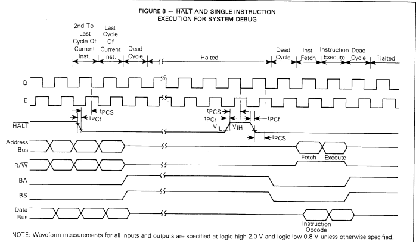

# MEZ6809設計メモ

奥江さんのMEZ6809の追試が基本だが、MC6809/HC6309(E無し版)のファーム設計側から基板への戻しまでの検討を記す。

本文書に引き続き、`memo_MEZ6809_design.md`に記述が移る。

## コンセプト

* RAM40, RAM48をターゲットとする。
  + なのでメザニン基板には6809CPUのみを載せる。
* ブートローディングは例によってシリアルからのテキスト形式アップロードとする。
  + 起動後ブートローディングモニタに入る。
* RAM40の場合アドレス16ピン全部接続が困難(2本抜ける)、命令置きまたはFF00番地ローダ置き。
  + 2本減らしても行けるかどうかをまず検討する。
  + 68系CPU(メモリマップドIO)の場合上記4ビットはつなぎたい。現状のRAM40を改造してPD0/PD1をWAIT/M1に充てる。

### 代表的な機能

* 外部クロックをEXTALに入れる。NOC1を使い最大8MHzを入れる。
* リセット後、HOLD + RESET で停止する。A6,A7 を Hi-Zとするため。
* 一定時間(MPLAB IDEがリセット後ダウンロード開始するまでの間以上)待ってからブートローダに入る。
* ブートローダ: 命令置きで1バイトR/Wできるようにする。
* RAM上のコードはフルスピードで動作、I/O(シリアルI/O)はクロックストレッチでサイクルを伸ばす。
* クロックストレッチを使いシングルステップ実行、ブレークポイントでの停止。
* NMIを使いMPU停止時のレジスタ内容取り出し。

## 制御線の検討

奥江版MEZ6809RAM基板をベースにINT系を追加した。DMA/BREQを割り当てから外し、代わりにHALTを入れた。

|Z80|Z80 Pin<br> Assign|EMUPU_RAM40<br>(改造版)|MEZZANINE<br> CPU(MC6809)|09pin|
|--|--|--|--|--|
6|CLK|RA3|EXTAL|38|
16|INT|RE2|RESET|37|
17|NMI|NC|NC|
18|HALT|NC|NC|
19|MREQ|RA1|E|34|
20|IORQ|RA0|MRDY|36|
21|RD|RA5|NMI|2|
22|WR|NC|NC(DMA/BREQ+10k pullup)|33|
23|BUSAK|NC|NC|
24|WAIT|RD0|R/W|32|
25|BUSRQ|RE0|HALT\*|33|
26|RESET|RE1|IRQ|3
27|M1|NC|NC|
28|RFSH|RD1|FIRQ|4

\* EMUPU_RAM40基板はWRは非接続、DMA/BREQは使わないのでWRにつないだままとしておく。10kプルアップも必要<br>
\** DMA/BREQの代わりにHALTを割り当てる。

ファーム書くときに参照する表

|PIC|Pin#|6809 Pin|Pin#|Z80 Pin|Pin#|
|--|--|--|--|--|--|
|RA0||MRDY|36|IORQ|20|
|RA1||E|34|MREQ|19|
|RA3||EXTAL|38|CLK|6|
|RA5||NMI|2|RD|21|
|RE0||HALT\*|33|BUSRQ|25|
|RE1||IRQ|3|RESET|26|
|RE2||RESET|37|INT|16|
|RD0||R/W|32|WAIT|24|
|RD1||FIRQ|4|RFSH|28|

### CLC割り当ての確認

RA/RC系４本とRB/RD系４本まで割り当てられる。

```
    // reconfigurate CLC devices
    // CLC pin assign
    // 0, 1, 4, 5: Port A, C
    // 2, 3, 6, 7: Port B, D
    CLCIN0PPS = 0x01;   // RA1 <- /MREQ
    CLCIN1PPS = 0x00;   // RA0 <- /IORQ
    CLCIN2PPS = 0x1F;   // RD7 <- /RFSH
    CLCIN3PPS = 0x1E;   // RD6 <- /WAIT
    CLCIN4PPS = 0x05;   // RA5 <- /RD
```

### 6809(non E version)のクロックストレッチ

* クロックジェネレータ内蔵で、その入力としてEXTAL端子にクロックを与えることができる。
* データバスはQの立ち上がり後に出力される(Write cycle)、よってデータ出力の戻しはEXTALクロックを延ばせばよい。
* メモリマップドI/Oなので、アドレスデコードでIORQを取る。A15,14,13で8kB領域をI/O領域とする。
* クロック停止は２種類
  + Eの立ち上がり(A15,14,13,E)でクロックを停止する。PIC側はE==Hとなったことを検出してI/Oアクセス処理を開始する。
  + I/O処理を終え、データバスにRead dataを置いた時点で、Eの立下り(A15,14,13,/E)でクロックを停止するようにする。  
    CLCの設定を変える(ロジック入力E -> /E)。クロック供給が再開され、今度はEの立下りでクロック供給が停止する。
  + ソフト側はE==Lを見つけた時点でDDRCをall 1に設定して、Eの立ち上がりを見るようにCLCの設定を変える(ロジック入力 /E -> E)。
* アドレスデコードをやめる(all 1とする)と、全メモリアクセスでストレッチされる。デバッグはまずこれで行う。
* ゲートを直接EXTALに出すとグリッジが出るので、内部にもう一つD-FFで2分周して、その入力をゲートするようにする。

|||||
|--|--|--|--|
|CLC1|2分周FF|1 input D-FF|D入力にCLC3OUTを入れる
|CLC2|ゲート2|4-input AND|A15,A14,A13,E or /E
|CLC3|ゲート3|4-input AND|/CLC2OUT x CLC1-/Q

* CLC1-/Qによる反転をゲートで止める。
* 通常はCLC2OUT == Lでこの時CLC3は素通しで、D-FFはクロックが来るごとに反転する。
* CLC2OUT == Hになると/CLC2OUT == Lになる。ゲート3がH固定となりCLC1 D-FFのD入力がH固定となる。次のクロック以後D-FFの出力はHに固定される。CPUクロックが停止し、E==Hのままストレッチされる。
* I/O処理を行う。Read Cycle(IN命令)ならばDDRC=0;としてデータをDATCに書き出す。
* 処理が終わるとCLC2のE入力を/E入力に切り替える。D入力は素通しとなるが、次のクロックまで反転しない。同期が成り立っており、グリッジも出ない。
* 次のクロックでCLKの供給が再開される。CPUの処理が進みE入力が反転すると再度クロックは停止する。
* ここでデータバス戻し(DDRC = 0b11111111;)を行う。
* データバスの戻し処理が終わるとCLC2の/E入力をE入力に切り替える。CLKの供給が再開されCPUの処理が進む。

```
    // 0, 1, 4, 5: Port A, C
    // 2, 3, 6, 7: Port B, D
    CLCIN0PPS = 0x01;   // RA1 <- E
    CLCIN2PPS = 0x1F;   // RD7 <- A15
    CLCIN3PPS = 0x1E;   // RD6 <- A14
    CLCIN6PPS = 0x1D;   // RD5 <- A13
    // output
    RA3PPS = 0xXX;      // RA3 <- 8MHz clock
```

### 6809Eのクロック生成

* 上記に加え、E/Q生成回路を設ける。
* 2ビット同期カウンタがちょうどよい。

|CLC|同期カウンタ|role||
|--|--|--|--|
|CLC3|bit0|1-input D-FF|/QをDに入れる
|CLC4|bit1|1-input D-FF|Q0, Q1 のXORをDに入れる|
|CLC5|bit1 set|OR-XOR|Q0,Q1を入力として出力を<br>D1に入れる。Q出力もここから取る。|

* CLC4OUTをEとして、CLC5OUTをQとすればよい。
* ストレッチ処理は6809無印と同じでよい。

### リセット/ファーム書き込み時

* A6/PB6,A7/PB7をHi-Zにしてからクロックを停止する。
* RESET時にはアドレスバスがHi-Zにならない($FFFEを出力し続ける)。
* HALT時にアドレスバスをHi-Zとする。これがよさそうだ。
* DMA/BREQでバスを空け渡した場合は15サイクルに1回MPUがバスを取りに来る。  
  このときのデータバスがHi-Zかどうかが見えない。
* 奥江さんのMEZ6809RAM基板はHALTを出していないので、ピン割り当て変更が必要だ。
* DMA/BREQを使わなさそうなので、これを外して代わりにHALTを割り当てた。

<figure style="text-align: center">

<figcaption>図6: HALTタイミング</figcaption>
</figure>


# Appendix 1: 信号の説明

### HALT

+ 実行中のインストラクション実行が完了後、実行を停止し、データを失うことなくhalt状態を維持する。
+ FIRQ,IRQには応答しない。
+ DMA/BREQは常に受理する。
+ NMI,RESETはラッチし、あとで応答する。
+ クロック(E,Q)は出続ける。
+ MPUが実行中でない(DMA/BREQ, RESET)場合、haltステージ(BA*BS=1)にするには、HALT,RESETともにLに張り付ける。
+ DMA/BREQ, HALTともにLとした場合、プロセッサは命令の最終サイクルに達してからhalt状態になる。

### BA,BS

+ BA(Bus Available)出力はバス出力MOSトランジスタがON/OFF(Hi-Z)かどうかを表す。
+ BS(Bus Status)出力は、BAと組み合わせてデコードするとCPUの状態がわかる。

|BA|BS|status||
|--|--|--|--|
|0|0|Normal(Running)|
|0|1|interrupt or Reset Acknowledge|アドレス下位4本を見て割り込み要因がわかる
|1|0|Sync Acknowledge|割り込み信号に与えられる外部同期待ち
|1|1|Halt or Bus Grant Acknowledge|

### NMI

+ 下りエッジでNMI要求検出。
+ 他の割り込みより優先度が高い。
+ マシン状態のすべてを退避
+ RESET後は、PC,SPに値が書き込まれるまでは割り込み認識されない。
+ 割り込み処理ルーチンの中でNMI発生要因を解消しておくこと。

### FIRQ

+ レベルLでFIRQ要求検出。Fフラグがクリア状態であること。

### IRQ

+ レベルLで検知、Iフラグがクリア状態であること。
+ スタックに全退避するので時間がかかる。

> + NMI,FIRQ,IRQはQクロックの下りエッジでサンプリングされる。割り込み認識に1クロックサイクルが必要。
> + 仕掛中の割り込みは、現在の命令実行が完了するまで取り上げられない。ただしSYNC, CWAI状態を除く。  
>   現在の命令実行完了を待たずに割り込み入力がHになると、その要求は認識されない。
> + NMIはラッチされるので、L保持は1サイクルだけでよい(意味よくわからん)
> + RESET下りエッジからBSの上りエッジまでの間は割り込み要求は識別されずラッチもされない。

### XTAL, EXTAL

+ 内蔵クロックジェネレータへの入力
+ 水晶を並列につなぐことでクロックが生成される。
+ EXTALにTTLレベルで外部クロックを供給して動かすこともできる。このときXTALはGNDにつなぐ。
+ 4倍クロック。

### E, Q

+ Eは6800のφ2に相当する。Qに相当するものはない。
+ Qの上りエッジとともにアドレスが有効になる。
+ データはEの下りエッジでラッチされる。
+ データバスはQの上りエッジ以後にHi-Zでなくなることが保証されている。

> クロック下限があるので、クロックを止めることはできない。ストレッチの際には注意。
> 6809無印, 68A09, 68B09とも: max10us(100kHz)

### MRDY

+ E,Qのタイミングを伸ばす。
+ MRDY == Hの間は通常通りのタイミング、Lにするとクロック伸ばしが生じる。
+ /VMAサイクルにはストレッチが効かない。
+ クロックの伸ばしにも使える。内蔵クロックジェネレータで発生したクロックで使える。

> 初期マスクではMRDYが4fクロックに同期することが必要だった。
> 
> 4桁ならG7F, 6桁なら前2桁が5A,6F,6Mの場合がやばい対象

### DMA/BREQ

+ 入力。バス要求。Qの下りエッジでサンプリングされる。
+ MPUはBA,BSにアクノレッジを表す。
+ 15バスサイクルの間、外部デバイスにバス使用が許される。15サイクルに1回セルフリフレッシュが入る。
+ Eの下りエッジでBA/BSに反映される。そのあとでアドレスバスが解放される。
+ バス解放、MPU再把握の間にデッドタイムがEの１周期分ある。
+ BA,BSでわかるタイミングではアドレスバス解放に至っていない。デッドタイミングがEの1周期分だけある。
+ 14 DMA cyclesに1回BA,BSが落ち、CPUがバスを使う。これ結構難しいよ。
+ DMAVMA信号生成: AN-820に説明がある。MC6844 DMACを使う前提らしい。

<figure style="text-align: center">

<figcaption>図3: DMAVMA信号生成</figcaption>
</figure>


<figure style="text-align: center">

<figcaption>図3: DMAVMA信号生成</figcaption>
</figure>

### バスタイミング

<figure style="text-align: center">

<figcaption>図1: バスタイミング</figcaption>
</figure>


