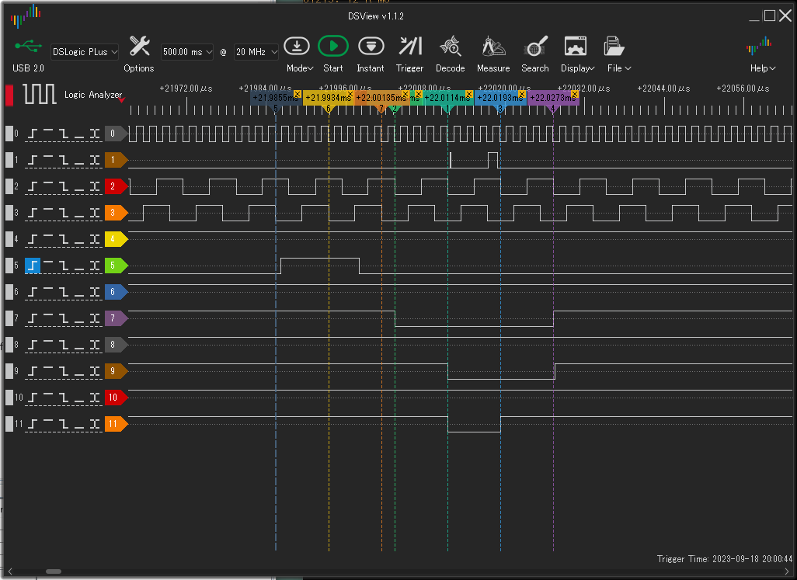

# MEZ6809 開発メモ

## コンセプト

* EMUZ80, EMUPU_RAM40,48で動作するメザニン基板
* I/O(シリアルポート)はクロックストレッチで実現、最初は低速クロックに全ソフト対応
* シングルステップとブレークポイントを実現する。
* シングルステップ時のレジスタダンプは、割り込み(NMI)を使ってレジスタ値を取得する。
* アドレスピンは16本とも接続する。これでピン数足りるかどうかが問題。

## 論点

* EMUPU_RAM40,48基板のRAMアクセスは間接接続を用いる。つまり、SRAM-OE,WEはPIC内部のCLCに発生させる。
* シングルステップはHALTを用いる。

## ファーム書き込み時の挙動

MPLAB SNAPを使用してファームを書き込む際に、リセット解除後どの程度のプログラム実行できるかどうかを確認した。測定結果は、
* MCLR解除後1.7ms程度で再度MCLRが入った。
* main関数の最初でTESTピンをトグルしたら1.5ms程度であった。

結局、0.2ms/200us程度分しか処理できない。この時間内にMPUの各端子とクロックを与える必要がある。

6809の場合、**RES(RESET)とHALT両方をLに落としてクロックをいくつか与えてやる**と、アドレスバスがHi-Zになるようである。このやり方でSNAP書き込みは確実に成功している(失敗したことはない)。

## 無限NOP

Eの立ち上がりでメモリアクセス処理を行い、Eの立下りでデータバスの戻し(入力モードに戻す)を行う。　戻し処理のコードは、

1. Eの上りエッジ検知直後に R/W(RA0)を見て
2. RならLATCにデータを置いてTRISC=0;を書き込む。

```
    while(1){
        int rw_flag;
        while(!RA1);    // Eの上りエッジを待つ
        if (ss_flag) {
            HALT_on();  // 初回から停止させるために必要
        }
        rw_flag = RA0;  // R/W
        if(RA0) { // R/W == 1, 6809 Read cycle (RW = 1)
            TOGGLE;
            addr = get_addr();
            LATC = 0x12;    // nop
            db_setout();
            //__delay_us(10);
```

```
    end_of_cycle:
        while(RA1); // E == Lを待つ(下りエッジ)
        TOGGLE;
        db_setin(); // Set data bus as input
        TOGGLE;
    }
```

## シングルステップ

HALTをLにしてMPUを止める。次の1命令だけの実行は、HALTをQの下りエッジでHになるように1周期だけHにして実現する。

下図はその例である。シングルステップの長時間処理(アドレス・データのシリアル出力処理、1.9ms弱掛かる)の最後にHALT(黄緑5)を1周期だけHにしている。

シリアル出力は以下のようになる。無限NOPである。最初のアドレス取得時から12を返しているので、1212番地からの実行開始となっている。

```
;->
0FFFE: 12 R M0
01212: 12 R M0
01213: 12 R M0
01214: 12 R M0
01215: 12 R M0
01216: 12 R M0
01217: 12 R M0
01218: 12 R M0
01219: 12 R M0
0121A: 12 R M0
0121B: 12 R M0
```
タイミングは以下の図の通りとなる。

<figure style="text-align: center">

<figcaption>図1. 1命令実行終了、次の実行のキック</figcaption>
</figure>

1. PICはHALTをHにする(灰色縦点線)。Qの下りエッジを検出直後にHを出力する。
2. 次のQ下りエッジ(黄色縦点線)でMPUがHALT==Hを検知する。MPUは実行再開に移行する。PICは次のQ下りエッジまでにHALTをLに戻す。
3. 次のQ下りエッジ(山吹色縦点線)ではHALTをLになっている。MPUはこれを検知して1命令のみ実行後再度停止する。
4. Q下りエッジ時点でEはHであるが、このサイクルはまだ停止状態。このEの下りエッジ(黄緑縦点線)の次から実行再開に移行する
5. 1サイクル目はダミーで、BSがLに堕ちているがまだ何もしていない(マニュアルでは/VMAサイクルと呼ばれている)。
6. E下りエッジ(緑色縦点線)が2サイクル目の始まりで、このエッジ直後に返し処理を行う。TEST端子(茶1)の細い方のパルスがその処理に使用する時間である。
6. 2サイクル目が最初のサイクル、命令フェッチが行われる。
   * アドレスバス(灰8～橙11が下位4ビット)に命令アドレスが出力され、そのサイクルのE下りエッジでデータバスがラッチされる。  
   + PIC側はEの上がりエッジ後アドレスバスにデータを置く。TEST端子(茶1)の広い方のパルスが、RAMフェッチからデータ置きまでの時間を表している。

コード断片は以下の通り。RA2がQ, RA1がEである。

```
        // HALT single shot
        if (ss_flag) {
            while(RA2);     // Q がLになる(下りエッジ:灰色)のを待って
            HALT_off();     // HALTをHにする
            while(!RA2);    // QがHになる(上りエッジ)のを待つ
            while(RA2);     // QがLになる(次の下りエッジ:黄色)のを待つ
                            // ここでMPUがHALT==Hをサンプリングする
            if (count-- > 0) {
                // skip one cycle
                while(!RA2);    // QがHになる(サンプリング後
                                // の上りエッジ)のを待つ
                HALT_on();  // HALTをLに戻す。
                while(RA2); // QがLになる(下りエッジ:橙色)を待つ
                // skip one E
                while(!RA2); // QがHになるのを待つ
                while(!RA1); // EがHになるのを待つ。1サイクル目の
                             // ダミーサイクル
            } else {
                ss_flag = 0;
            }
            // このあと、HALTの入らない通常の返し処理に流れ込む。
```

## ピン割り当て

EMUZ80基板でのピン割り当て、RAM40,48で、RA2,RA4がSRAM専用に割り当てられていたので空けておいたのだが、どうしてもQが必要となり、RA2を割り当てた。

RAM40基板でアドレス16本割り当てるとポートが足りなくなる。RAM48基板を用いることとする。

|09#|6809|PIC|Z80|Z80#|プローブ
|--|--|--|--|--|--|
34|E|RA1|MREQ|19|赤2
32|R/W|RA0|IORQ|20|黄4
38|EXTAL|RA3|CLK|6|灰0
2|NMI|RA5|RD|21|
40|HALT|RE0|BUSRQ|25(WR22)|緑5
37|RESET|RE1|RESET|26|青6
  |TEST|RE2|INT|16|茶1
35|Q|RA2|RFSH|28|橙3